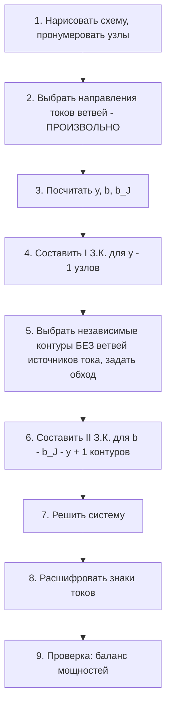

Отличный вопрос — «посчитал уравнения, а дальше что?». Дальше работает один и тот же алгоритм, и я покажу его целиком на **случайной цепи, которой нет в лекции**. Вот она:

## Учебный пример: случайная цепь

**Дано:** $J_k = 6$ А, $E_1 = 4$ В, $R_1 = 1$ Ом, $R_2 = 2$ Ом, $R_3 = 6$ Ом.
**Найти:** токи ветвей $I_1, I_2, I_3$.

```tikz
\begin{document}
\begin{tikzpicture}[scale=1.0]
  % Шины (узлы)
  \draw (0,3) -- (7.5,3);
  \draw (0,0) -- (7.5,0);
  % Ветвь a: источник тока J_k
  \draw (0,0) -- (0,1.15);
  \draw (0,1.5) circle [radius=0.35];
  \draw[->, thick] (0,1.25) -- (0,1.75);
  \node[left=3pt] at (-0.35,1.5) {$J_k$};
  \draw (0,1.85) -- (0,3);
  % Ветвь b: E1 + R1
  \draw (2.5,0) -- (2.5,0.65);
  \draw (2.5,1.0) circle [radius=0.35];
  \draw[->, thick] (2.5,0.75) -- (2.5,1.25);
  \node[left=3pt] at (2.15,1.0) {$E_1$};
  \draw (2.5,1.35) -- (2.5,1.7);
  \draw[fill=white] (2.25,1.7) rectangle (2.75,2.5);
  \node[right=3pt] at (2.75,2.1) {$R_1$};
  \draw (2.5,2.5) -- (2.5,3);
  \draw[->, thick] (2.9,2.2) -- (2.9,2.7) node[right=1pt] {$I_1$};
  % Ветвь c: R2
  \draw (5,0) -- (5,1.1);
  \draw[fill=white] (4.75,1.1) rectangle (5.25,1.9);
  \node[right=3pt] at (5.25,1.5) {$R_2$};
  \draw (5,1.9) -- (5,3);
  \draw[->, thick] (5.4,2.4) -- (5.4,1.9) node[right=1pt] {$I_2$};
  % Ветвь d: R3
  \draw (7.5,0) -- (7.5,1.1);
  \draw[fill=white] (7.25,1.1) rectangle (7.75,1.9);
  \node[right=3pt] at (7.75,1.5) {$R_3$};
  \draw (7.5,1.9) -- (7.5,3);
  \draw[->, thick] (7.9,2.4) -- (7.9,1.9) node[right=1pt] {$I_3$};
  % Узлы
  \fill (3.7,3) circle (2.5pt) node[above=2pt] {1};
  \fill (3.7,0) circle (2.5pt) node[below=2pt] {2};
  % Контуры обхода (красные)
  \draw[->, red, thick] (3.75,1.5) arc (45:-270:0.4);
  \node[red] at (3.75,0.8) {I};
  \draw[->, red, thick] (6.25,1.5) arc (45:-270:0.4);
  \node[red] at (6.25,0.8) {II};
\end{tikzpicture}
\end{document}
```

*Легенда: стрелки у $J_k, I_1, I_2, I_3$ — выбранные направления токов; красные круговые стрелки I и II — направления обхода контуров (по часовой).*

---

## Алгоритм разбора (ответ на «а дальше что?»)



Ты остановился на шаге 3. Разбираю по шагам, что идёт после.

### Шаг 3 (твой): топология
- Узлы: $у = 2$ (верхняя шина — узел 1, нижняя — узел 2).
- Ветви: $в = 4$ ($J_k$; $E_1+R_1$; $R_2$; $R_3$).
- Ветви с источниками тока: $в_J = 1$.
- Уравнений: по I З.К. $у-1 = 1$; по II З.К. $в - в_J - у + 1 = 4-1-2+1 = 2$.
- Неизвестных токов: $в - в_J = 3$ (ток ветви с $J_k$ **известен** — он и есть $J_k$). Сходится: $1+2=3$.

### Шаг 4: I закон Кирхгофа
Направления токов уже стоят на схеме (выбраны произвольно!). Для узла 1 (входящие «+», выходящие «−»): $J_k$ и $I_1$ входят, $I_2$ и $I_3$ выходят:
$$J_k + I_1 - I_2 - I_3 = 0 \quad\Rightarrow\quad 6 + I_1 - I_2 - I_3 = 0$$
(Для узла 2 уравнение не пишем — оно не независимое, получится то же самое с обратным знаком.)

### Шаг 5: выбор контуров — ключевой момент
Бери «окна» схемы так, чтобы каждое добавляло хотя бы одну новую ветвь (независимость), и **не загоняй контур в ветвь с источником тока**: напряжение на источнике тока неизвестно, и член $I \cdot R$ для него записать нельзя. Поэтому окна «$J_k$–$E_1R_1$» мы не используем, а берём:
- **Контур I** (окно между ветвями $E_1R_1$ и $R_2$), обход по часовой;
- **Контур II** (окно между $R_2$ и $R_3$), обход по часовой.

### Шаг 6: II закон Кирхгофа с расстановкой знаков
**Контур I** (обход по часовой: вверх по ветви $E_1R_1$, вниз по $R_2$):
- $I_1$ совпадает с обходом → $+I_1 R_1$;
- $I_2$ совпадает с обходом → $+I_2 R_2$;
- стрелка $E_1$ совпадает с обходом → $+E_1$ в правой части.
$$I_1 R_1 + I_2 R_2 = E_1 \quad\Rightarrow\quad 1\cdot I_1 + 2\cdot I_2 = 4$$

**Контур II** (обход по часовой: вверх по $R_2$, вниз по $R_3$):
- $I_2$ направлен **против** обхода → $-I_2 R_2$;
- $I_3$ совпадает с обходом → $+I_3 R_3$;
- ЭДС в контуре нет → справа 0.
$$-I_2 R_2 + I_3 R_3 = 0 \quad\Rightarrow\quad -2\cdot I_2 + 6\cdot I_3 = 0$$

### Шаг 7: решить систему
Из контура II: $I_3 = \dfrac{I_2}{3}$. Из контура I: $I_1 = 4 - 2I_2$. Подставляем в узел:
$$6 + (4 - 2I_2) - I_2 - \frac{I_2}{3} = 0 \;\Rightarrow\; 10 = \frac{10}{3}I_2 \;\Rightarrow\; I_2 = 3\ \text{А}$$
$$I_1 = 4 - 6 = -2\ \text{А}, \qquad I_3 = 1\ \text{А}$$

### Шаг 8: расшифровать знаки
$I_1 = -2$ А — знак «минус» означает: **реальный ток течёт противоположно нарисованной стрелке** (вниз, а не вверх). Это нормально: направления мы выбирали наугад. Остальные токи положительные — стрелки угаданы.

### Шаг 9: баланс мощностей (проверка)
Напряжение между узлами: $U_{12} = I_2 R_2 = 6$ В.
- Источник тока отдаёт: $P_{J} = U_{12}\cdot J_k = 6\cdot 6 = 36$ Вт (ток выходит в «+» узла 1).
- ЭДС $E_1$: $P_{E} = E_1 \cdot I_1 = 4\cdot(-2) = -8$ Вт — отрицательно, значит источник **не отдаёт, а потребляет** (как заряжаемый аккумулятор): реальный ток идёт против его стрелки.
- Всего отдано: $36 - 8 = 28$ Вт.
- Потрачено на резисторах: $I_1^2 R_1 + I_2^2 R_2 + I_3^2 R_3 = 4\cdot1 + 9\cdot2 + 1\cdot6 = 28$ Вт. ✅ Баланс сошёлся — система решена верно.

---

> [!tip] Главные места, где сыпятся
> 1. **Направления токов — произвольные.** Ошибка в знаке на этапе «угадывания» невозможна: всё исправит знак ответа.
> 2. **Контуры не должны проходить через источники тока** (иначе некуда деть неизвестное напряжение на $J_k$). Число контуров поэтому $в - в_J - у + 1$.
> 3. **Знаки во II З.К.** ставятся только относительно обхода: ток/ЭДС по обходу → «+», против → «−». Направление обхода тоже произвольное.
> 4. **Проверка балансом мощностей** ловит 99% арифметических ошибок. Если не сошлось — ищи знак в уравнениях, а не в арифметике.

> [!note] Матричная форма для этого примера (если требуется в ДЗ)
> $$\begin{pmatrix} 1 & -1 & -1 \\ R_1 & R_2 & 0 \\ 0 & -R_2 & R_3 \end{pmatrix}\cdot\begin{pmatrix} I_1 \\ I_2 \\ I_3 \end{pmatrix} = \begin{pmatrix} -J_k \\ E_1 \\ 0 \end{pmatrix}$$
> Строки 2–4 узловой матрицы из твоей лекции работают так же: в столбце каждого тока ровно два ненулевых элемента (+1 и −1), потому что ветвь соединяет два узла.

Вот и весь разбор: после подсчёта числа уравнений остаётся механика — узлы → контуры → система → знаки → баланс. Хочешь, дам ещё одну случайную цепь посложнее (с мостом или двумя ЭДС в одном контуре), чтобы ты потренировался сам, а я проверю?

---

```tikz
\begin{document}
\begin{tikzpicture}[
    thick,
    resistorH/.style = {draw, fill=white, minimum width=1.0cm, minimum height=0.35cm, inner sep=0pt},
    resistorV/.style = {draw, fill=white, minimum width=0.35cm, minimum height=1.0cm, inner sep=0pt},
    source/.style    = {draw, fill=white, circle, minimum size=0.95cm, inner sep=0pt},
    lab/.style       = {font=\small}
]
% Узлы: A(0,6) B(4,6) C(8,6) / D(0,2) E(4,2) F(8,2) / G(0,0) H(8,0)

% --- Провода ---
\draw (0,6) -- (8,6);   % верхняя линия (через R8)
\draw (0,6) -- (0,0);   % левая ветвь (E1, Rr)
\draw (4,6) -- (4,2);   % средняя вертикаль (Rr, E2)
\draw (4,6) -- (8,2);   % диагональ (E3)
\draw (8,6) -- (8,0);   % правая ветвь (R4)
\draw (0,2) -- (8,2);   % средняя горизонталь (R6, R5)
\draw (0,0) -- (8,0);   % нижняя линия (E7)

% --- Резисторы ---
\node[resistorH] (R8)  at (2,6)   {};
\node[resistorV] (Rr1) at (0,3.5) {};
\node[resistorV] (Rr2) at (4,4.6) {};
\node[resistorV] (R4)  at (8,4)   {};
\node[resistorH] (R6)  at (2,2)   {};
\node[resistorH] (R5)  at (6,2)   {};

% --- Источники ЭДС ---
\node[source] (E1) at (0,5)   {};
\node[source] (E2) at (4,3.1) {};
\node[source] (E3) at (6,4)   {};
\node[source] (E7) at (4,0)   {};

% --- Стрелки направлений ЭДС внутри кружков ---
\draw[->] (0,4.65)    -- (0,5.35);    % E1 вверх
\draw[->] (4,2.75)    -- (4,3.45);    % E2 вверх
\draw[->] (5.72,4.28) -- (6.28,3.72); % E3 по диагонали (вниз-вправо)
\draw[->] (3.65,0)    -- (4.35,0);    % E7 вправо

% --- Подписи ---
\node[lab] at (2,6.45)    {$R_8$};
\node[lab] at (0.55,3.5)  {$R_r$};
\node[lab] at (3.5,4.6)   {$R_r$};
\node[lab] at (8.55,4)    {$R_4$};
\node[lab] at (2,2.45)    {$R_6$};
\node[lab] at (6,2.45)    {$R_5$};
\node[lab] at (0.7,4.75)  {$E_1$};
\node[lab] at (4.7,3.1)   {$E_2$};
\node[lab] at (6.8,4.35)  {$E_3$};
\node[lab] at (4,0.7)     {$E_7$};

% --- Точки соединения (узлы) ---
\foreach \p in {(4,6),(0,2),(4,2),(8,2)} \fill \p circle (1.5pt);
\end{tikzpicture}
\end{document}
```

```tikz
\begin{document}
\begin{tikzpicture}[
    thick,
    resistorH/.style = {draw, fill=white, minimum width=1.0cm, minimum height=0.35cm, inner sep=0pt},
    resistorV/.style = {draw, fill=white, minimum width=0.35cm, minimum height=1.0cm, inner sep=0pt},
    source/.style    = {draw, fill=white, circle, minimum size=0.95cm, inner sep=0pt},
    lab/.style       = {font=\small}
]
% Узлы: 1(4,6) 2(0,2) 3(4,2) 4(8,2)

% --- Провода ---
\draw (0,6) -- (8,6);
\draw (0,6) -- (0,0);
\draw (4,6) -- (4,2);
\draw (4,6) -- (8,2);
\draw (8,6) -- (8,0);
\draw (0,2) -- (8,2);
\draw (0,0) -- (8,0);

% --- Резисторы ---
\node[resistorH] (R8)  at (2,6)   {};
\node[resistorV] (Rr1) at (0,3.5) {};
\node[resistorV] (Rr2) at (4,4.6) {};
\node[resistorV] (R4)  at (8,4)   {};
\node[resistorH] (R6)  at (2,2)   {};
\node[resistorH] (R5)  at (6,2)   {};

% --- Источники ЭДС ---
\node[source] (E1) at (0,5)   {};
\node[source] (E2) at (4,3.1) {};
\node[source] (E3) at (6,4)   {};
\node[source] (E7) at (4,0)   {};

% --- Стрелки ЭДС внутри кружков ---
\draw[->] (0,4.65)    -- (0,5.35);
\draw[->] (4,2.75)    -- (4,3.45);
\draw[->] (5.72,4.28) -- (6.28,3.72);
\draw[->] (3.65,0)    -- (4.35,0);

% --- Подписи элементов ---
\node[lab] at (2,6.45)    {$R_8$};
\node[lab] at (0.55,3.5)  {$R_r$};
\node[lab] at (3.5,4.6)   {$R_r$};
\node[lab] at (8.55,4)    {$R_4$};
\node[lab] at (2,2.45)    {$R_6$};
\node[lab] at (6,2.45)    {$R_5$};
\node[lab] at (0.7,4.75)  {$E_1$};
\node[lab] at (4.7,3.1)   {$E_2$};
\node[lab] at (6.8,4.35)  {$E_3$};
\node[lab] at (4,0.7)     {$E_7$};

% --- ТОКИ ВЕТВЕЙ (синим, направления выбраны произвольно) ---
\draw[->, blue, very thick] (-0.5,3.9) -- (-0.5,4.6) node[left, lab]  {$I_1$};
\draw[->, blue, very thick] (4.5,3.6)  -- (4.5,4.3)  node[right, lab] {$I_2$};
\draw[->, blue, very thick] (5.2,5.1)  -- (5.7,4.6)  node[above right, lab] {$I_3$};
\draw[->, blue, very thick] (8.5,5.3)  -- (8.5,4.6)  node[right, lab] {$I_4$};
\draw[->, blue, very thick] (3.6,2.5)  -- (2.9,2.5)  node[above, lab] {$I_5$};
\draw[->, blue, very thick] (5.5,2.5)  -- (4.8,2.5)  node[above, lab] {$I_6$};
\draw[->, blue, very thick] (2.4,0.5)  -- (3.1,0.5)  node[above, lab] {$I_7$};

% --- Номера узлов ---
\node[lab, above right=2pt] at (4,6) {1};
\node[lab, above left=2pt]  at (0,2) {2};
\node[lab, below right=2pt] at (4,2) {3};
\node[lab, above right=2pt] at (8,2) {4};

% --- Точки соединения (узлы) ---
\foreach \p in {(4,6),(0,2),(4,2),(8,2)} \fill \p circle (1.5pt);

% --- ОБХОДЫ КОНТУРОВ (красным, все по часовой) ---
\draw[->, red, very thick] (2,4)     arc (45:-270:0.45);
\node[red, lab] at (2,3.3)   {I};
\draw[->, red, very thick] (5.4,3.6) arc (45:-270:0.35);
\node[red, lab] at (5.4,3.0)   {II};
\draw[->, red, very thick] (7.2,4.9) arc (45:-270:0.35);
\node[red, lab] at (7.7,4.55)  {III};
\draw[->, red, very thick] (6,1)     arc (45:-270:0.35);
\node[red, lab] at (6,0.45)    {IV};
\end{tikzpicture}
\end{document}
```
Держи: сначала улучшенный код твоей схемы (твой стиль сохранён, добавлены номера узлов, стрелки токов синим, обходы контуров красным), ниже — полный разбор по Кирхгофу. Замечу: эта схема топологически **та же**, что на доске в прошлый раз, просто переподписана ($R_3\to R_8$, $E_4\to E_7$, а левый и средний резисторы у тебя оба названы $R_r$ — в уравнениях я так и оставлю: два резистора одно1го номинала; если они разные — переименуй в $R_1, R_2$ и замени в формулах).
`
## Схема с деталями (токи, узлы, контуры)

```tikz
\begin{document}
\begin{tikzpicture}[
    thick,
    resistorH/.style = {draw, fill=white, minimum width=1.0cm, minimum height=0.35cm, inner sep=0pt},
    resistorV/.style = {draw, fill=white, minimum width=0.35cm, minimum height=1.0cm, inner sep=0pt},
    source/.style    = {draw, fill=white, circle, minimum size=0.95cm, inner sep=0pt},
    lab/.style       = {font=\small}
]
% Узлы: 1(4,6) 2(0,2) 3(4,2) 4(8,2)

% --- Провода ---
\draw (0,6) -- (8,6);
\draw (0,6) -- (0,0);
\draw (4,6) -- (4,2);
\draw (4,6) -- (8,2);
\draw (8,6) -- (8,0);
\draw (0,2) -- (8,2);
\draw (0,0) -- (8,0);

% --- Резисторы ---
\node[resistorH] (R8)  at (2,6)   {};
\node[resistorV] (Rr1) at (0,3.5) {};
\node[resistorV] (Rr2) at (4,4.6) {};
\node[resistorV] (R4)  at (8,4)   {};
\node[resistorH] (R6)  at (2,2)   {};
\node[resistorH] (R5)  at (6,2)   {};

% --- Источники ЭДС ---
\node[source] (E1) at (0,5)   {};
\node[source] (E2) at (4,3.1) {};
\node[source] (E3) at (6,4)   {};
\node[source] (E7) at (4,0)   {};

% --- Стрелки ЭДС внутри кружков ---
\draw[->] (0,4.65)    -- (0,5.35);
\draw[->] (4,2.75)    -- (4,3.45);
\draw[->] (5.72,4.28) -- (6.28,3.72);
\draw[->] (3.65,0)    -- (4.35,0);

% --- Подписи элементов ---
\node[lab] at (2,6.45)    {$R_8$};
\node[lab] at (0.55,3.5)  {$R_r$};
\node[lab] at (3.5,4.6)   {$R_r$};
\node[lab] at (8.55,4)    {$R_4$};
\node[lab] at (2,2.45)    {$R_6$};
\node[lab] at (6,2.45)    {$R_5$};
\node[lab] at (0.7,4.75)  {$E_1$};
\node[lab] at (4.7,3.1)   {$E_2$};
\node[lab] at (6.8,4.35)  {$E_3$};
\node[lab] at (4,0.7)     {$E_7$};

% --- ТОКИ ВЕТВЕЙ (синим, направления выбраны произвольно) ---
\draw[->, blue, very thick] (-0.5,3.9) -- (-0.5,4.6) node[left, lab]  {$I_1$};
\draw[->, blue, very thick] (4.5,3.6)  -- (4.5,4.3)  node[right, lab] {$I_2$};
\draw[->, blue, very thick] (5.2,5.1)  -- (5.7,4.6)  node[above right, lab] {$I_3$};
\draw[->, blue, very thick] (8.5,5.3)  -- (8.5,4.6)  node[right, lab] {$I_4$};
\draw[->, blue, very thick] (3.6,2.5)  -- (2.9,2.5)  node[above, lab] {$I_5$};
\draw[->, blue, very thick] (5.5,2.5)  -- (4.8,2.5)  node[above, lab] {$I_6$};
\draw[->, blue, very thick] (2.4,0.5)  -- (3.1,0.5)  node[above, lab] {$I_7$};

% --- Номера узлов ---
\node[lab, above right=2pt] at (4,6) {1};
\node[lab, above left=2pt]  at (0,2) {2};
\node[lab, below right=2pt] at (4,2) {3};
\node[lab, above right=2pt] at (8,2) {4};

% --- Точки соединения (узлы) ---
\foreach \p in {(4,6),(0,2),(4,2),(8,2)} \fill \p circle (1.5pt);

% --- ОБХОДЫ КОНТУРОВ (красным, все по часовой) ---
\draw[->, red, very thick] (2,4)     arc (45:-270:0.45);
\node[red, lab] at (2,3.3)   {I};
\draw[->, red, very thick] (5.4,3.6) arc (45:-270:0.35);
\node[red, lab] at (5.4,3.0)   {II};
\draw[->, red, very thick] (7.2,4.9) arc (45:-270:0.35);
\node[red, lab] at (7.7,4.55)  {III};
\draw[->, red, very thick] (6,1)     arc (45:-270:0.35);
\node[red, lab] at (6,0.45)    {IV};
\end{tikzpicture}
\end{document}
```

**Легенда:** синие стрелки — выбранные направления токов ветвей ($I_1$ по левой ветви вверх через $E_1$; $I_2$ по средней вертикали вверх через $E_2$; $I_3$ по диагонали от 1 к 4; $I_4$ по правой ветви вниз; $I_5$ по $R_6$ влево (3→2); $I_6$ по $R_5$ влево (4→3); $I_7$ по нижней ветви вправо через $E_7$). Красные круговые стрелки — о`бходы контуров I–IV, все по часовой.

## Топология

- Узлы: $у = 4$ (точки 1–4; углы и изгибы проводов — не узлы).
- Ветви: $в = 7$:
 1. $E_1, R_r, R_8$ (2–1), ток $I_1$;
 2. $R_r, E_2$ (3–1), ток $I_2$;
 3. $E_3$ (1–4, диагональ, **без сопротивления**), ток $I_3$;
 4. $R_4$ (1–4, через верх-право), ток $I_4$;
 5. $R_6$ (2–3), ток $I_5$;
 6. $R_5$ (3–4), ток $I_6$;
 7. $E_7$ (2–4, низ), ток $I_7$.
- Источников тока нет: $в_J = 0$.
- Уравнений: I З.К. $у-1 = 3$; II З.К. $в-в_J-у+1 = 7-0-4+1 = 4$. Неизвестных токов 7 → система замкнута. ✅

## I закон Кирхгофа (узлы 1, 2, 3)

$$\text{Узел 1:}\quad I_1 + I_2 - I_3 - I_4 = 0$$
$$\text{Узел 2:}\quad -I_1 + I_5 - I_7 = 0$$
$$\text{Узел 3:}\quad -I_2 - I_5 + I_6 = 0$$

## II закон Кирхгофа (контуры I–IV, обход по часовой)

**Контур I** (левое окно: вверх по $E_1R_rR_8$, вниз по $R_rE_2$, влево по $R_6$):
$$I_1 (R_r + R_8) - I_2 R_r + I_5 R_6 = E_1 - E_2$$
($I_1, I_5$ по обходу → «+»; $I_2$ против → «−»; $E_1$ по обходу → «+», $E_2$ против → «−».)

**Контур II** (треугольник 1–4–3: по диагонали $E_3$ вниз, влево по $R_5$, вверх по $R_rE_2$):
$$I_2 R_r + I_6 R_5 = E_2 + E_3$$
(у диагонали нет сопротивления, поэтому $I_3$ слева отсутствует, но $E_3$ входит в правую часть: обход совпадает со стрелкой.)

**Контур III** (окно между диагональю $E_3$ и правой ветвью $R_4$: вниз по $R_4$, вверх по диагонали):
$$I_4 R_4 = -E_3$$
(обход против стрелки $E_3$ → «−» справа.)

**Контур IV** (нижнее окно: вправо по $R_6, R_5$, влево по низу через $E_7$):
$$I_5 R_6 + I_6 R_5 = E_7$$
(обход по верху против $I_5, I_6$, по низу против $I_7$ и против стрелки $E_7$; после сокращения минусов — запись выше.)

## Матричная форма $[R]\cdot[I]=[E]$

$$\begin{pmatrix}
1 & 1 & -1 & -1 & 0 & 0 & 0\\
-1 & 0 & 0 & 0 & 1 & 0 & -1\\
0 & -1 & 0 & 0 & -1 & 1 & 0\\
R_r+R_8 & -R_r & 0 & 0 & R_6 & 0 & 0\\
0 & R_r & 0 & 0 & 0 & R_5 & 0\\
0 & 0 & 0 & R_4 & 0 & 0 & 0\\
0 & 0 & 0 & 0 & R_6 & R_5 & 0
\end{pmatrix}
\cdot
\begin{pmatrix} I_1\\ I_2\\ I_3\\ I_4\\ I_5\\ I_6\\ I_7 \end{pmatrix}
=
\begin{pmatrix} 0\\ 0\\ 0\\ E_1-E_2\\ E_2+E_3\\ -E_3\\ E_7 \end{pmatrix}$$

> [!tip] Особенности этой схемы (те же, что у доски)
> - Диагональ — чистая ЭДС $E_3$: $I_3$ живёт только в узловом уравнении 1, в контурные он не попадает (нет $R$). Систему это не ломает.
> - Между узлами 1 и 4 две параллельные ветви ($E_3$ и $R_4$) — они и дают контур III; без него потерялось бы уравнение для $I_4$.
> - Два резистора подписаны $R_r$: в уравнениях они честно входят каждый в свою ветвь (строки 4 и 5). Если это разные номиналы — переименуй и подставь.
> - Проверка узловых строк: в каждом столбце токов ровно два ненулевых элемента (+1 и −1).

Дальше стандартно: подставляешь номиналы → решаешь систему (из контура III сразу $I_4=-E_3/R_4$, из II и IV связываются $I_2,I_6$ и $I_5,I_6$, остальное добирают узлы) → минусы в ответах переворачиваешь стрелки → сверяешь баланс мощностей $\sum E_k I_k = \sum I_k^2 R_k$. Дашь числа — посчитаю до конца с проверкой.


### Объяснение формулы диаметра разбиения

Формула:
$$d_i = \operatorname{diam}(Q_i) = \sup_{A, B \in Q_i} \rho(A, B)$$

#### 1. Разбор обозначений:
* **$Q_i$** — это $i$-я элементарная ячейка (пространственный кусочек тела), на которые мы разбили всё тело $Q$.
* **$A, B \in Q_i$** — две произвольные точки, принадлежащие этой ячейке $Q_i$.
* **$\rho(A, B)$** — расстояние между точками $A$ и $B$ (в трёхмерном евклидовом пространстве $\mathbb{R}^3$ это обычное расстояние между точками по формуле длины отрезка: $\sqrt{(x_A - x_B)^2 + (y_A - y_B)^2 + (z_A - z_B)^2}$).
* **$\sup$ (супремум)** — точная верхняя грань (максимально возможное значение).
* **$\operatorname{diam}(Q_i)$ (или $d_i$)** — **диаметр области $Q_i$**.

#### 2. Физический и геометрический смысл:
Диаметр произвольного тела — это **наибольшее расстояние между любыми двумя его точками**:
* Для шара диаметр в этом смысле в точности равен обычному диаметру сферы.
* Для прямоугольного параллелепипеда (кирпича) со сторонами $\Delta x, \Delta y, \Delta z$ диаметр — это длина его **главной пространственной диагонали**: $\sqrt{\Delta x^2 + \Delta y^2 + \Delta z^2}$.
* Для фигуры произвольной неправильной формы диаметр — это длина максимального отрезка, который целиком или концами лежит в этой фигуре.

#### 3. Зачем это нужно в интеграле?
В одномерном интеграле отрезок разбивают на части длины $\Delta x_i \to 0$.  
В тройном интеграле нельзя просто требовать, чтобы объём ячейки $\Delta V_i \to 0$. Если бы мы стягивали к нулю только объём, ячейка могла бы превратиться в бесконечно длинную и тонкую «иголку» или плоский «блин», и тогда плотность $\rho(x,y,z)$ вдоль такой длинной ячейки сильно менялась бы, разрушая всю идею приближения константой.

Поэтому вводят параметр разбиения:
$$d(T) = \max_{1 \le i \le n} d_i \to 0$$
Требование **$d(T) \to 0$** гарантирует, что каждая ячейка сжимается в точку **по всем трём измерениям сразу**, благодаря чему функция внутри ячейки действительно стремится к постоянному значению.

---

Ниже приведён полный текст лекции с вынесением определений в блоки `> [!info]` и исправленными кодами графиков под актуальный синтаксис Obsidian TikZJax (обёртка `\begin{document}...\end{document}`, отсутствие кириллицы и комментариев внутри блоков, современный синтаксис `circle [radius=...]` и `ellipse [x radius=..., y radius=...]`).

---

## 1. Физическая мотивация и определение тройного интеграла

### 1.1. Физическая задача: вычисление массы неоднородного пространственного тела

Представим, что в пространстве $\mathbb{R}^3$ с декартовой системой координат $Oxyz$ задано некоторое материальное тело, занимающее замкнутую ограниченную область $Q$. 

Тело является **неоднородным**: его плотность в каждой точке $M(x, y, z)$ не постоянна, а задаётся непрерывной положительной функцией:
$$\rho = \rho(x, y, z) > 0, \quad \forall M(x, y, z) \in Q$$

```tikz
\begin{document}
\begin{tikzpicture}[scale=1.1, >=stealth]
    \draw[->] (0,0,0) -- (4.5,0,0) node[below right] {$y$};
    \draw[->] (0,0,0) -- (0,4,0) node[above] {$z$};
    \draw[->] (0,0,0) -- (0,0,4) node[below left] {$x$};
    \node at (-0.2,-0.2,0) {$O$};
    \draw[thick, fill=gray!15, fill opacity=0.6] 
        plot [smooth cycle, tension=0.8] coordinates {
            (1.5, 2.8, 1.0) (3.2, 3.2, 0.5) (3.5, 1.8, 0.5) 
            (2.8, 1.0, 1.5) (1.2, 1.2, 2.0) (0.8, 2.2, 1.5)
        };
    \node at (3.5, 2.8, 0.8) {$Q \subset \mathbb{R}^3$};
    \draw[thick, fill=blue!25, fill opacity=0.8] 
        (1.8, 2.0, 1.2) ellipse [x radius=0.35, y radius=0.25];
    \fill (1.8, 2.0, 1.2) circle [radius=1.2pt];
    \node[right=2pt] at (1.8, 2.0, 1.2) {\scriptsize $M_i(x_i, y_i, z_i)$};
    \node at (1.2, 1.8, 1.2) {\scriptsize $Q_i$};
\end{tikzpicture}
\end{document}
```

Чтобы найти полную массу такого тела, применим классический метод интегрального исчисления:
1. **Разбиение.** Разобьём область $Q$ произвольной сеткой поверхностей на $n$ мелких элементарных областей (ячеек) $Q_i$ ($i = 1, \dots, n$), удовлетворяющих двум условиям:
   - Области полностью покрывают тело: $\bigcup_{i=1}^n Q_i = Q$;
   - Области не перекрываются внутренними точками: $\operatorname{int}(Q_i) \cap \operatorname{int}(Q_j) = \varnothing$ при $i \neq j$.
2. **Диаметр ячейки.** Для каждой частичной области $Q_i$ определим её диаметр $d_i$ как максимальное расстояние между любыми двумя её точками:
   $$d_i = \operatorname{diam}(Q_i) = \sup_{A, B \in Q_i} \rho(A, B)$$
   *Диаметром разбиения* $T = \{Q_1, Q_2, \dots, Q_n\}$ назовём величину:
   $$d(T) = \max_{1 \le i \le n} d_i$$
3. **Линеаризация на элементарной ячейке.** Объём элементарной области обозначим через $\Delta V_i$. Внутри каждой ячейки $Q_i$ выберем произвольную точку $M_i(x_i, y_i, z_i) \in Q_i$.
   Так как область $Q_i$ достаточно мала, а плотность непрерывна, плотность во всех точках ячейки приближённо постоянна и равна $\rho(x_i, y_i, z_i)$. Тогда приближённая масса ячейки:
   $$\Delta m_i \approx \rho(x_i, y_i, z_i) \Delta V_i$$
4. **Интегральная сумма.** Суммируя по всем $n$ ячейкам, получаем приближённую массу всего тела:
   $$M \approx \sum_{i=1}^n \Delta m_i = \sum_{i=1}^n \rho(x_i, y_i, z_i) \Delta V_i$$
5. **Предельный переход.** Точная масса получается при стремлении диаметра разбиения к нулю ($d(T) \to 0$, при этом $n \to \infty$):
   $$M = \lim_{d(T) \to 0} \sum_{i=1}^n \rho(x_i, y_i, z_i) \Delta V_i$$

---

### 1.2. Математическое определение тройного интеграла

Пусть в замкнутой ограниченной пространственной области $Q \subset \mathbb{R}^3$ задана произвольная ограниченная скалярная функция $f(x, y, z)$ (или $f(M)$).

1. Выполним разбиение $T = \{Q_1, \dots, Q_n\}$ области $Q$.
2. В каждой частичной области $Q_i$ выберем точку $M_i(x_i, y_i, z_i) \in Q_i$.
3. Составим **интегральную сумму Римана**:
   $$S(T) = \sum_{i=1}^n f(M_i) \Delta V_i = \sum_{i=1}^n f(x_i, y_i, z_i) \Delta V_i$$

> [!info] Определение (Тройной интеграл)
> Если при $d(T) \to 0$ существует конечный предел интегральной суммы $S(T)$, который **не зависит ни от способа разбиения** $T$ области $Q$, **ни от выбора промежуточных точек** $M_i \in Q_i$, то функция $f(x, y, z)$ называется **интегрируемой** в области $Q$.  
> Сам этот предел называется **тройным интегралом** от функции $f(x, y, z)$ по области $Q$ и обозначается:
> $$\lim_{d(T) \to 0} \sum_{i=1}^n f(M_i) \Delta V_i = \iiint_Q f(x, y, z)\,dx\,dy\,dz \quad \text{или} \quad \iiint_Q f(M)\,dV$$

*Замечание лектора по обозначениям:*  
Полная запись с дифференциалами по трем переменным:
$$\iiint_Q f(x, y, z)\,dx\,dy\,dz$$
Иногда её сокращают до одного знака интеграла с символом элемента объёма:
$$\int_Q f(M)\,dV$$
Оба обозначения равноправны.

---

### 1.3. Теоремы существования (интегрируемости)

> **Теорема 1 (Достаточное условие интегрируемости).**  
> Всякая функция $f(x, y, z)$, ограниченная в замкнутой области $Q$ и непрерывная всюду в $Q$, за исключением, быть может, конечного числа точек или точек гладких поверхностей нулевого объёма, является интегрируемой в области $Q$.

> **Теорема 2.**  
> Всякая непрерывная в замкнутой ограниченной области $Q$ функция $f(x, y, z)$ интегрируема в этой области.

---

## 2. Свойства тройного интеграла

Свойства тройного интеграла полностью аналогичны свойствам двойного интеграла и обычного определённого интеграла Римана:

1. **Объём области.** Интеграл от тождественной единицы равен объёму области интегрирования $V_Q$:
   $$\iiint_Q 1 \cdot dV = \iiint_Q dx\,dy\,dz = V_Q$$
   *(Физический смысл: если плотность тела тождественно равна $1$, то масса численно совпадает с его объёмом).*

2. **Линейность.** Если функции $f(M)$ и $g(M)$ интегрируемы в $Q$, то для любых действительных чисел $\alpha, \beta \in \mathbb{R}$ функция $\alpha f(M) + \beta g(M)$ также интегрируема в $Q$, и справедливо:
   $$\iiint_Q \big(\alpha f(M) + \beta g(M)\big)\,dV = \alpha \iiint_Q f(M)\,dV + \beta \iiint_Q g(M)\,dV$$

3. **Аддитивность по области.** Если область $Q$ разбита на две части $Q'$ и $Q'' = Q \setminus Q'$, не имеющие общих внутренних точек ($\operatorname{int}(Q') \cap \operatorname{int}(Q'') = \varnothing$), то:
   $$\iiint_Q f(M)\,dV = \iiint_{Q'} f(M)\,dV + \iiint_{Q \setminus Q'} f(M)\,dV$$

4. **Сохранение знака (неотрицательность).** Если $f(M) \ge 0$ во всех точках $M \in Q$, то:
   $$\iiint_Q f(M)\,dV \ge 0$$

5. **Монотонность.** Если $f(M) \ge g(M)$ для всех $M \in Q$, то:
   $$\iiint_Q f(M)\,dV \ge \iiint_Q g(M)\,dV$$

6. **Оценка модуля интеграла:**
   $$\left| \iiint_Q f(M)\,dV \right| \le \iiint_Q |f(M)|\,dV$$

7. **Теорема об оценке интеграла.** Пусть функция $f(M)$ ограничена на $Q$:
   $$m \le f(M) \le M, \quad \forall M \in Q$$
   Тогда:
   $$m \cdot V_Q \le \iiint_Q f(M)\,dV \le M \cdot V_Q$$

8. **Теорема о среднем значении.** Если функция $f(M)$ непрерывна в связной замкнутой области $Q$, то существует такая точка $M_0(x_0, y_0, z_0) \in Q$, что:
   $$\iiint_Q f(M)\,dV = f(M_0) \cdot V_Q$$
   Величина $f(M_0) = \frac{1}{V_Q} \iiint_Q f(M)\,dV$ называется *средним значением функции* $f$ в области $Q$.

---

### Геометрическое понятие: кубируемость области

> [!info] Определение (Кубируемая область)
> В двойном интеграле рассматриваются квадрируемые области (имеющие определённую площадь). В пространстве трёх измерений используется термин **кубируемая область** — ограниченное тело, объём которого можно аппроксимировать многогранниками, описанными вокруг тела и вписанными внутрь него, при этом разность их объёмов стремится к нулю при измельчении сетки.  
> Корректное интегрирование определено только по кубируемым областям с кусочно-гладкими границами.

---

## 3. Вычисление тройного интеграла в декартовых координатах

### 3.1. Цилиндрическая область (проекция на плоскость $Oxy$)

Пусть область $Q$ является правильной (цилиндрической) относительно оси $Oz$:
$$Q = \left\{ (x, y, z) \in \mathbb{R}^3 \mid (x, y) \in D \subset \mathbb{R}^2, \quad z_1(x, y) \le z \le z_2(x, y) \right\}$$
где:
- $D$ — проекция области $Q$ на координатную плоскость $Oxy$;
- $z = z_1(x, y)$ — поверхность, ограничивающая тело снизу (вход луча, параллельного $Oz$);
- $z = z_2(x, y)$ — поверхность, ограничивающая тело сверху (выход луча).

```tikz
\begin{document}
\begin{tikzpicture}[scale=1.1, >=stealth]
    \draw[->] (0,0) -- (5.2,0) node[right] {$y$};
    \draw[->] (0,0) -- (0,5.0) node[above] {$z$};
    \draw[->] (0,0) -- (-2.2,-2.2) node[below left] {$x$};
    \node at (-0.2,0.2) {$O$};

    \draw[thick, fill=gray!20, fill opacity=0.7] (2,-1) ellipse [x radius=1.4, y radius=0.7];
    \node at (2,-1) {$D$};

    \draw[dashed, gray] (0.7,-1) -- (0.7, 2.5);
    \draw[dashed, gray] (3.3,-1) -- (3.3, 3.8);

    \draw[thick, fill=blue!15, fill opacity=0.6] 
        plot [smooth cycle, tension=0.7] coordinates {
            (0.7, 1.8) (2.0, 1.3) (3.3, 2.0) (2.5, 2.5) (1.2, 2.4)
        };
    \node[right] at (3.3, 2.0) {$z_1(x, y)$};

    \draw[thick, fill=blue!25, fill opacity=0.6] 
        plot [smooth cycle, tension=0.7] coordinates {
            (0.7, 3.8) (2.0, 3.2) (3.3, 4.0) (2.6, 4.5) (1.2, 4.3)
        };
    \node[right] at (3.3, 4.0) {$z_2(x, y)$};
    \node at (2.0, 2.8) {$Q$};

    \fill (2.1,-1.1) circle [radius=1.2pt];
    \node[below] at (2.1,-1.1) {\scriptsize $(x,y)$};
    \draw[->, thick, red] (2.1,-1.1) -- (2.1, 1.6);
    \draw[thick, red] (2.1, 1.6) -- (2.1, 3.5);
    \draw[->, thick, red] (2.1, 3.5) -- (2.1, 4.6);
\end{tikzpicture}
\end{document}
```

> **Теорема (Сведение тройного интеграла к повторному).**  
> Если функция $f(x, y, z)$ интегрируема в области $Q$, и для каждой фиксированной точки $(x, y) \in D$ существует внутренний интеграл:
> $$I(x, y) = \int_{z_1(x, y)}^{z_2(x, y)} f(x, y, z)\,dz$$
> то существует повторный интеграл, и выполняется равенство:
> $$\iiint_Q f(x, y, z)\,dx\,dy\,dz = \iint_D dx\,dy \left( \int_{z_1(x, y)}^{z_2(x, y)} f(x, y, z)\,dz \right)$$

Если проекция $D$ на плоскость $Oxy$ сама является стандартной областью:
$$D = \{ (x, y) \mid a \le x \le b, \; y_1(x) \le y \le y_2(x) \}$$
то тройной интеграл расписывается как трёхкратный повторный интеграл:
$$\iiint_Q f(x, y, z)\,dx\,dy\,dz = \int_a^b dx \int_{y_1(x)}^{y_2(x)} dy \int_{z_1(x, y)}^{z_2(x, y)} f(x, y, z)\,dz$$

### Порядки интегрирования
Поскольку у нас 3 переменные, количество возможных перестановок порядка интегрирования равно $3! = 6$:
1. $dx\,dy\,dz$
2. $dx\,dz\,dy$
3. $dy\,dx\,dz$
4. $dy\,dz\,dx$
5. $dz\,dx\,dy$
6. $dz\,dy\,dx$

Выбор порядка определяется геометрией задачи: предпочтителен тот порядок, при котором область **не дробится** на части, а пределы интегрирования описываются наиболее простыми функциями.

---

## 4. Пример 1: Вычисление интеграла по пирамиде (разбор порядка интегрирования)

### Постановка задачи
Вычислить тройной интеграл:
$$I = \iiint_Q x\,dx\,dy\,dz$$
где область $Q$ ограничена плоскостями:
$$x + z = 1, \quad y + z = 1, \quad x = 0, \quad y = 0, \quad z = 0$$

---

### Геометрический анализ области $Q$ (Предостережение лектора)

> **Внимание! Классическая ошибка на зачётах и экзаменах:**  
> Студенты часто путают эту фигуру с правильным тетраэдром $x + y + z = 1$.  
> В тетраэдре в плоскости $z = 0$ получается треугольник $x + y \le 1$.  
> Здесь же у нас **две независимые наклонные плоскости**:
> - $x + z = 1$ — плоскость, параллельная оси $Oy$;
> - $y + z = 1$ — плоскость, параллельная оси $Ox$.
> 
> На плоскости основания $z = 0$ получаем прямые $x = 1$ и $y = 1$, а также оси координат $x = 0$, $y = 0$.  
> **Основанием данной фигуры является квадрат** $[0, 1] \times [0, 1]$ на плоскости $Oxy$.  
> Сама фигура представляет собой **четырёхскатную пирамиду** с вершиной в точке $(0, 0, 1)$ и квадратным основанием со стороной $1$.

```tikz
\begin{document}
\begin{tikzpicture}[scale=2.0, >=stealth]
    \draw[->] (0,0,0) -- (1.5,0,0) node[below left] {$x$};
    \draw[->] (0,0,0) -- (0,1.7,0) node[above] {$z$};
    \draw[->] (0,0,0) -- (0,0,1.8) node[right] {$y$};
    \node at (-0.08,-0.08,0) {\scriptsize $0$};

    \coordinate (Top) at (0,1.2,0);
    \coordinate (X1) at (1.1,0,0);
    \coordinate (Y1) at (0,0,1.4);
    \coordinate (XY1) at (1.1,0,1.4);

    \draw[dashed] (0,0,0) -- (X1);
    \draw[dashed] (0,0,0) -- (Y1);
    \draw[thick] (X1) -- (XY1) -- (Y1);

    \draw[thick] (Top) -- (X1) node[midway, left=2pt] {\scriptsize $x+z=1$};
    \draw[thick] (Top) -- (Y1) node[midway, above right] {\scriptsize $y+z=1$};
    \draw[thick] (Top) -- (XY1) node[midway, right=3pt] {\scriptsize $x=y$};

    \fill (Top) circle [radius=0.8pt];
    \node[left] at (Top) {\scriptsize $1$};
    \fill (X1) circle [radius=0.8pt];
    \node[below] at (X1) {\scriptsize $1$};
    \fill (Y1) circle [radius=0.8pt];
    \node[right] at (Y1) {\scriptsize $1$};
    \fill (XY1) circle [radius=0.8pt];

    \draw[dashed, red] (0,0,0) -- (XY1);
    \node[red] at (0.7,0,0.5) {\scriptsize $D_1$};
    \node[red] at (0.4,0,1.0) {\scriptsize $D_2$};
\end{tikzpicture}
\end{document}
```

---

### Способ 1: Внутреннее интегрирование по $z$ (Неудобный путь — расщепление на 2 интеграла)

Если мы проецируем фигуру на плоскость $Oxy$, проекцией является квадрат $D = [0, 1] \times [0, 1]$.  
Однако верхняя граница $z$ образована двумя разными плоскостями:
- если $x \ge y$, то ближе к основанию лежит плоскость $z = 1 - x$;
- если $y \ge x$, то верхней границей служит плоскость $z = 1 - y$.

Диагональ $x = y$ делит квадрат $D$ на два треугольника:
$$D_1 = \{ 0 \le x \le 1, \; 0 \le y \le x \}, \quad z \in [0, 1 - x]$$
$$D_2 = \{ 0 \le y \le 1, \; 0 \le x \le y \}, \quad z \in [0, 1 - y]$$

Тогда тройной интеграл распадается на сумму двух повторных интегралов:
$$I = \iint_{D_1} dx\,dy \int_0^{1-x} x\,dz + \iint_{D_2} dx\,dy \int_0^{1-y} x\,dz$$
Этот путь правильный, но требует вычисления двух интегралов.

---

### Способ 2: Рациональный выбор порядка интегрирования (Проекция на плоскость $Oxz$)

Спроецируем фигуру на координатную плоскость $Oxz$.  
В этой плоскости ограничение задано прямой $x + z = 1$, а также осями $x = 0$ и $z = 0$.  
Проекция $D_{xOz}$ представляет собой простой треугольник:
$$D_{xOz} = \{ (x, z) \mid 0 \le x \le 1, \; 0 \le z \le 1 - x \}$$

```tikz
\begin{document}
\begin{tikzpicture}[scale=2.0, >=stealth]
    \draw[->] (0,0) -- (1.5,0) node[right] {$x$};
    \draw[->] (0,0) -- (0,1.5) node[above] {$z$};
    \draw[thick, fill=blue!15] (0,0) -- (1.2,0) -- (0,1.2) -- cycle;
    \node at (0.35,0.35) {$D_{xOz}$};
    \draw (0,1.2) node[left] {$1$} -- (1.2,0) node[below] {$1$};
    \node[above right] at (0.5,0.6) {$x + z = 1$};
    \node at (-0.1,-0.1) {$0$};
\end{tikzpicture}
\end{document}
```

Теперь зафиксируем точку $(x, z) \in D_{xOz}$ и посмотрим, как меняется $y$:
- Луч входит в тело через плоскость $y = 0$;
- Луч выходит из тела через плоскость $y + z = 1 \implies y = 1 - z$.

Порядок интегрирования $dy\,dz\,dx$ **не требует разбиения области на части**:
$$I = \int_0^1 dx \int_0^{1-x} dz \int_0^{1-z} x\,dy$$

#### Пошаговое вычисление:
1. **Внутренний интеграл по $y$:**
   $$\int_0^{1-z} x\,dy = x \cdot [y]_0^{1-z} = x(1 - z)$$
2. **Интеграл по $z$:**
   $$\int_0^{1-x} x(1 - z)\,dz = x \left[ z - \frac{z^2}{2} \right]_0^{1-x} = x \left( (1 - x) - \frac{(1 - x)^2}{2} \right) = x \left( \frac{1 - x^2}{2} \right) = \frac{x - x^3}{2}$$
3. **Внешний интеграл по $x$:**
   $$I = \int_0^1 \frac{x - x^3}{2}\,dx = \frac{1}{2} \left[ \frac{x^2}{2} - \frac{x^4}{4} \right]_0^1 = \frac{1}{2} \left( \frac{1}{2} - \frac{1}{4} \right) = \frac{1}{2} \cdot \frac{1}{4} = \frac{1}{8}$$

*Вывод лектора:* Грамотный выбор порядка интегрирования спас нас от громоздких вычислений с разбиением области!

---

## 5. Замена переменных в тройном интеграле

### 5.1. Общая формула замены переменных

Пусть область $Q \subset \mathbb{R}^3$ в координатах $(x, y, z)$ является образом области $\Omega \subset \mathbb{R}^3$ в новых криволинейных координатах $(\xi, \eta, \zeta)$ под действием взаимно однозначного отображения:
$$\begin{cases}
x = x(\xi, \eta, \zeta) \\
y = y(\xi, \eta, \zeta) \\
z = z(\xi, \eta, \zeta)
\end{cases}$$

Предполагается, что функции обладают непрерывными частными производными первого порядка в области $\Omega$.

```tikz
\begin{document}
\begin{tikzpicture}[scale=0.95, >=stealth]
    \begin{scope}[shift={(0,0)}]
        \draw[->] (0,0,0) -- (3,0,0) node[right] {$\eta$};
        \draw[->] (0,0,0) -- (0,3,0) node[above] {$\zeta$};
        \draw[->] (0,0,0) -- (0,0,3) node[below left] {$\xi$};
        \draw[thick, fill=green!15] (0.8,0.8,0) -- (2.0,0.8,0) -- (2.0,2.0,0) -- (0.8,2.0,0) -- cycle;
        \draw[thick, fill=green!25] (0.8,2.0,0) -- (2.0,2.0,0) -- (2.0,2.0,1.2) -- (0.8,2.0,1.2) -- cycle;
        \draw[thick, fill=green!20] (2.0,0.8,0) -- (2.0,2.0,0) -- (2.0,2.0,1.2) -- (2.0,0.8,1.2) -- cycle;
        \node at (1.4,2.5,0.6) {$\Omega$};
    \end{scope}

    \draw[->, very thick] (3.5,1.5) -- (5.5,1.5);
    \node[above] at (4.5,1.6) {$\vec{r}(\xi,\eta,\zeta)$};

    \begin{scope}[shift={(6.5,0)}]
        \draw[->] (0,0,0) -- (3,0,0) node[right] {$y$};
        \draw[->] (0,0,0) -- (0,3,0) node[above] {$z$};
        \draw[->] (0,0,0) -- (0,0,3) node[below left] {$x$};
        \draw[thick, fill=blue!15] plot [smooth cycle, tension=0.7] 
            coordinates {(0.8,0.9) (2.4,0.7) (2.2,2.3) (0.9,2.0)};
        \node at (1.6,2.5,0) {$Q$};
    \end{scope}
\end{tikzpicture}
\end{document}
```

> [!info] Определение (Якобиан отображения)
> **Якобианом (определителем Якоби)** отображения называется определитель матрицы частных производных порядка $3 \times 3$:
> $$J(\xi, \eta, \zeta) = \frac{\partial(x, y, z)}{\partial(\xi, \eta, \zeta)} = \begin{vmatrix}
> \dfrac{\partial x}{\partial \xi} & \dfrac{\partial x}{\partial \eta} & \dfrac{\partial x}{\partial \zeta} \\[8pt]
> \dfrac{\partial y}{\partial \xi} & \dfrac{\partial y}{\partial \eta} & \dfrac{\partial y}{\partial \zeta} \\[8pt]
> \dfrac{\partial z}{\partial \xi} & \dfrac{\partial z}{\partial \eta} & \dfrac{\partial z}{\partial \zeta}
> \end{vmatrix}$$

> **Теорема.**  
> Если якобиан $J(\xi, \eta, \zeta) \neq 0$ всюду в области $\Omega$, то справедлива формула замены переменных:
> $$\iiint_Q f(x, y, z)\,dx\,dy\,dz = \iiint_\Omega f\big(x(\xi, \eta, \zeta), y(\xi, \eta, \zeta), z(\xi, \eta, \zeta)\big) \cdot |J(\xi, \eta, \zeta)|\,d\xi\,d\eta\,d\zeta$$

---

## 6. Цилиндрическая система координат

Цилиндрические координаты $(r, \varphi, z)$ представляют собой естественное обобщение полярных координат на трёхмерное пространство: на плоскости $Oxy$ вводятся полярные координаты $(r, \varphi)$, а координата $z$ остаётся декартовой аппликатой.

```tikz
\begin{document}
\begin{tikzpicture}[scale=1.2, >=stealth]
    \draw[->] (0,0,0) -- (4.5,0,0) node[below right] {$y$};
    \draw[->] (0,0,0) -- (0,4.2,0) node[above] {$z$};
    \draw[->] (0,0,0) -- (0,0,4.2) node[below left] {$x$};
    \node at (-0.2,0.2) {$O$};

    \coordinate (M) at (2.2, 3.2, 2.5);
    \coordinate (Mproj) at (2.2, 0, 2.5);

    \draw[dashed, thick] (M) -- (Mproj);
    \draw[dashed] (Mproj) -- (0,0,0);
    \draw[dashed] (M) -- (0, 3.2, 0) node[left] {$z$};

    \fill (M) circle [radius=1.5pt];
    \node[above right] at (M) {$M(x,y,z) = M(r,\varphi,z)$};
    \fill (Mproj) circle [radius=1.2pt];
    \node[below right] at (Mproj) {$M'(r,\varphi,0)$};

    \draw[thick, blue] (0,0,0) -- (Mproj) node[midway, below] {$r$};
    \draw[->, thick, red] (0,0,1.2) arc[start angle=90, end angle=45, radius=1.2];
    \node[red] at (0.5,0,1.4) {$\varphi$};
    \draw[thick, dashed, green!60!black] (Mproj) -- (M) node[midway, right] {$z$};
\end{tikzpicture}
\end{document}
```

### Связь декартовых и цилиндрических координат:
$$\begin{cases}
x = r \cos \varphi \\
y = r \sin \varphi \\
z = z
\end{cases}$$

### Области изменения координат:
$$r \ge 0, \quad \varphi \in [0, 2\pi] \;\; (\text{или } [-\pi, \pi]), \quad z \in (-\infty, +\infty)$$

### Вычисление якобиана цилиндрической системы координат:
Матрица Якоби имеет вид:
$$J = \begin{vmatrix}
\dfrac{\partial x}{\partial r} & \dfrac{\partial x}{\partial \varphi} & \dfrac{\partial x}{\partial z} \\[8pt]
\dfrac{\partial y}{\partial r} & \dfrac{\partial y}{\partial \varphi} & \dfrac{\partial y}{\partial z} \\[8pt]
\dfrac{\partial z}{\partial r} & \dfrac{\partial z}{\partial \varphi} & \dfrac{\partial z}{\partial z}
\end{vmatrix}
= \begin{vmatrix}
\cos \varphi & -r \sin \varphi & 0 \\
\sin \varphi & r \cos \varphi & 0 \\
0 & 0 & 1
\end{vmatrix}$$

Раскладывая определитель по третьей строке (или третьему столбцу):
$$J = 1 \cdot (-1)^{3+3} \begin{vmatrix}
\cos \varphi & -r \sin \varphi \\
\sin \varphi & r \cos \varphi
\end{vmatrix} = r \cos^2 \varphi - (-r \sin^2 \varphi) = r(\cos^2 \varphi + \sin^2 \varphi) = r$$

Так как $r \ge 0$, то $|J| = r$.

### Элемент объёма в цилиндрических координатах:
$$dV = dx\,dy\,dz = r\,dr\,d\varphi\,dz$$

### Формула перехода:
$$\iiint_Q f(x, y, z)\,dx\,dy\,dz = \iiint_\Omega f(r\cos\varphi, r\sin\varphi, z) \cdot r\,dr\,d\varphi\,dz$$

---

## 7. Пример 2: Тело, ограниченное сферой и конусом

### Постановка задачи
Найти объём тела $Q$, ограниченного сферой и конусом:
$$\begin{cases}
x^2 + y^2 + z^2 = 2a^2 \quad (\text{сфера радиуса } R = a\sqrt{2}) \\
x^2 + y^2 = z^2 \quad (\text{конус с вершиной в начале координат})
\end{cases}$$
Тело расположено **внутри конуса** (то есть удовлетворяет неравенству $x^2 + y^2 \le z^2$).

---

### Анализ геометрии и симметрии

```tikz
\begin{document}
\begin{tikzpicture}[scale=1.4, >=stealth]
    \draw[->] (-2.5,0) -- (2.5,0) node[right] {$y$};
    \draw[->] (0,-2.5) -- (0,2.5) node[above] {$z$};
    \node at (-0.2,-0.2) {$O$};

    \draw[thick] (0,0) circle [radius=2.0];
    \node[above right] at (1.4,1.4) {$x^2+y^2+z^2=2a^2$};

    \draw[thick, blue] (-2,-2) -- (2,2);
    \draw[thick, blue] (-2,2) -- (2,-2);

    \fill[blue!25, fill opacity=0.6] 
        (0,0) -- (1.414, 1.414) 
        arc[start angle=45, end angle=135, radius=2.0] -- cycle;

    \draw[dashed, red] (-1.414, 1.414) -- (1.414, 1.414);
    \fill (0, 1.414) circle [radius=1.2pt];
    \node[left] at (0, 1.414) {$a$};
    \node[right] at (1.414, 1.414) {$\; z = a, \; r = a$};

    \fill[blue!15, fill opacity=0.4] 
        (0,0) -- (1.414, -1.414) 
        arc[start angle=-45, end angle=-135, radius=2.0] -- cycle;
    \draw[dashed, red] (-1.414, -1.414) -- (1.414, -1.414);
    \fill (0, -1.414) circle [radius=1.2pt];
    \node[left] at (0, -1.414) {$-a$};

    \node at (0, 1.8) {$Q^+$};
    \node at (0, -1.8) {$Q^-$};
\end{tikzpicture}
\end{document}
```

1. **Пересечение поверхностей:**
   Подставим уравнение конуса $x^2 + y^2 = z^2$ в уравнение сферы:
   $$z^2 + z^2 = 2a^2 \implies 2z^2 = 2a^2 \implies z^2 = a^2 \implies z = \pm a$$
   Линия пересечения сферы и верхней половины конуса лежит в горизонтальной плоскости $z = a$.
2. **Проекция линии пересечения на плоскость $Oxy$:**
   При $z = a$:
   $$x^2 + y^2 = a^2$$
   Это окружность радиуса $a$ с центром в начале координат.  
   Следовательно, проекция области $Q$ на плоскость $Oxy$ представляет собой **круг**:
   $$D = \{ (x, y) \mid x^2 + y^2 \le a^2 \}$$
3. **Симметрия:**
   Область симметрична относительно плоскости $Oxy$. Тело состоит из двух равных «шапок» (верхней $Q^+$ при $z > 0$ и нижней $Q^-$ при $z < 0$). Поэтому:
   $$V = 2 \iiint_{Q^+} dx\,dy\,dz$$

---

### Метод А: Смешанный (повторный интеграл с переходом к полярным координатам)

Для верхней половины $Q^+$:
- Снизу область ограничена конусом: $z_1(x, y) = \sqrt{x^2 + y^2}$;
- Сверху область ограничена сферой: $z_2(x, y) = \sqrt{2a^2 - x^2 - y^2}$.

Интегрируем сначала по $z$ в декартовых координатах:
$$V = 2 \iint_D dx\,dy \int_{\sqrt{x^2+y^2}}^{\sqrt{2a^2-x^2-y^2}} dz = 2 \iint_D \left( \sqrt{2a^2 - x^2 - y^2} - \sqrt{x^2 + y^2} \right) dx\,dy$$

Так как область $D$ — круг радиуса $a$, переходим к полярным координатам:
$$x = r\cos\varphi, \quad y = r\sin\varphi, \quad dx\,dy = r\,dr\,d\varphi$$
Пределы:
$$\varphi \in [0, 2\pi], \quad r \in [0, a]$$

Получаем:
$$V = 2 \int_0^{2\pi} d\varphi \int_0^a \left( \sqrt{2a^2 - r^2} - r \right) r\,dr$$

---

### Метод Б: Непосредственная расстановка пределов в цилиндрических координатах

Запишем уравнения поверхностей сразу в цилиндрических координатах:
- Конус: $z = r$;
- Сфера: $r^2 + z^2 = 2a^2 \implies z = \sqrt{2a^2 - r^2}$.

Пределы изменения всех трёх цилиндрических переменных:
$$\begin{cases}
0 \le \varphi \le 2\pi \\
0 \le r \le a \\
r \le z \le \sqrt{2a^2 - r^2}
\end{cases}$$

Тогда объём равен:
$$V = 2 \int_0^{2\pi} d\varphi \int_0^a r\,dr \int_r^{\sqrt{2a^2 - r^2}} dz$$

---

### Вычисление интеграла:

1. **Интеграл по $\varphi$:**
   $$\int_0^{2\pi} d\varphi = 2\pi$$
   С учётом множителя $2$ перед интегралом:
   $$2 \cdot 2\pi = 4\pi$$

2. **Интеграл по $r$:**
   $$V = 4\pi \int_0^a \left( r\sqrt{2a^2 - r^2} - r^2 \right) dr = 4\pi \left( \underbrace{\int_0^a r\sqrt{2a^2 - r^2}\,dr}_{I_1} - \underbrace{\int_0^a r^2\,dr}_{I_2} \right)$$

3. **Вычисление $I_1$:**
   Сделаем замену переменной $t = 2a^2 - r^2$, тогда $dt = -2r\,dr \implies r\,dr = -\frac{1}{2}\,dt$.
   - При $r = 0$: $t = 2a^2$;
   - При $r = a$: $t = 2a^2 - a^2 = a^2$.

   $$I_1 = \int_{2a^2}^{a^2} \sqrt{t} \left(-\frac{1}{2}\right) dt = \frac{1}{2} \int_{a^2}^{2a^2} t^{1/2}\,dt = \frac{1}{2} \cdot \left[ \frac{2}{3} t^{3/2} \right]_{a^2}^{2a^2} = \frac{1}{3} \Big( (2a^2)^{3/2} - (a^2)^{3/2} \Big) = \frac{a^3}{3} \big( 2\sqrt{2} - 1 \big)$$

4. **Вычисление $I_2$:**
   $$I_2 = \int_0^a r^2\,dr = \left[ \frac{r^3}{3} \right]_0^a = \frac{a^3}{3}$$

5. **Окончательный результат:**
   $$V = 4\pi \left( \frac{a^3}{3} (2\sqrt{2} - 1) - \frac{a^3}{3} \right) = \frac{4\pi a^3}{3} \big( 2\sqrt{2} - 2 \big) = \frac{8\pi a^3}{3} (\sqrt{2} - 1)$$

---

## Итоги лекции
1. **Тройной интеграл** строится как предел римановых сумм по разбиениям пространственного тела на ячейки с объёмами $\Delta V_i$.
2. В декартовых координатах тройной интеграл сводится к повторному интегрированию (обычно сначала по $z$, затем двойной по плоской проекции $D$). Порядок интегрирования выбирается так, чтобы избежать искусственного расщепления области.
3. При замене переменных объёмный дифференциал преобразуется с помощью модуля якобиана:
   $$dx\,dy\,dz = |J|\,d\xi\,d\eta\,d\zeta$$
4. В **цилиндрической системе координат** ($x=r\cos\varphi$, $y=r\sin\varphi$, $z=z$) якобиан равен $|J| = r$, а элемент объёма:
   $$dV = r\,dr\,d\varphi\,dz$$
   Цилиндрические координаты наиболее эффективны, когда область ограничена телами вращения вокруг оси $Oz$ (конусы, цилиндры, параболоиды, сферы).