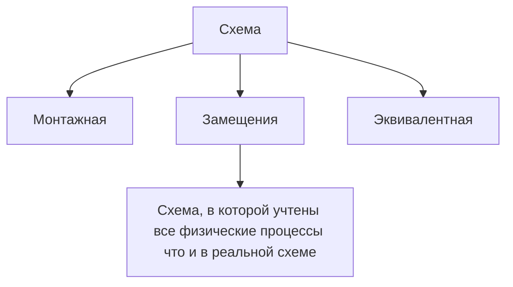

> [!info] Линейные цепи
> Цепи, в которых все элементы имеют постоянные вольт-амперные характеристики

> [!info] Цепи постоянного тока
> Цепи, в которых напряжение $U$ и ток $I$ с течением времени не изменяются. 

---

## Величины в цепях постоянного/переменного тока

> [!tldr] Цепи постоянного тока
> $I$ - *ток* = $[A]$ - *ампер*
> Амперметр. Включается в цепь последовательно. 
>```tikz
>\usepackage{circuitikz}
\begin{document}
\begin{circuitikz}
  \draw (0,0) to[ammeter, i=$I$] (3,0);
\end{circuitikz}
\end{document}
>```
>---
> $U$ - *напряжение, разность потенциалов* = $[B]$ - *вольт* = $\varphi_1-\varphi_2$ 
> Вольтметр. Включается в цепь параллельно. 
>```tikz
\usepackage{circuitikz}
\begin{document}
\begin{circuitikz}
  \draw (0,0) to[voltmeter, v=$U$] (3,0);
\end{circuitikz}
\end{document}
>```
>---
>ЭДС
> $E$ — работа сторонних сил по перемещению единичного положительного заряда по замкнутому контуру; $[E]$ = В.

> [!tldr] Цепи переменного тока
> |**Величины**| Ток            | Наряжение      | ЭДС            |
| --------------- | -------------- | -------------- | -------------- |
| **Мгновенные**  | $i$            | $u$            | $e$            |
| **Действующие** | $I$            | $U$            | $E$            |
| **Амплитуда**   | $I_m$          | $U_m$          | $E_m$          |
|**Комплексные действующие**| $\underline I$ | $\underline U$ | $\underline E$ |
|**Комплексные амплитуды**| $\dot I$       | $\dot U$       | $\dot E$       |

---

## Источники питания

> [!info] Источник напряжения
> Такой источник, который **независимо от нагрузки** поддерживает на своих зажимах одно и то же напряжение $U$.

```tikz
\begin{document}
\begin{tikzpicture}[scale=0.95]
  \draw (0,0.95) -- (0,2.2) -- (1.8,2.2);
  \draw (0,0.25) -- (0,0) -- (1.8,0);
  \draw (0,0.6) circle [radius=0.35];
  \draw[->] (0,0.42) -- (0,0.78);
  \node[right] at (0.1,0.6) {$E$};
  \fill (1.8,2.2) circle [radius=1.5pt];
  \fill (1.8,0) circle [radius=1.5pt];
  \draw[->] (2.3,2.15) -- (2.3,0.2);
  \node[right] at (2.4,1.2) {$U$};
  \draw (4,1.85) -- (4,2.2) -- (5.8,2.2);
  \draw (4,1.15) -- (4,0.95);
  \draw (4,0.35) -- (4,0) -- (5.8,0);
  \draw (4,1.5) circle [radius=0.35];
  \draw[->] (4,1.32) -- (4,1.68);
  \node[right] at (4.1,1.5) {$E$};
  \draw (3.85,0.35) rectangle (4.15,0.95);
  \node[right] at (4.2,0.65) {$r_0$};
  \fill (5.8,2.2) circle [radius=1.5pt];
  \fill (5.8,0) circle [radius=1.5pt];
  \draw[->] (6.3,2.15) -- (6.3,0.2);
  \node[right] at (6.4,1.2) {$U$};
  \draw (7.6,2.2) -- (9.2,2.2);
  \draw (7.6,0) -- (9.2,0);
  \fill (7.6,2.2) circle [radius=1.5pt];
  \fill (7.6,0) circle [radius=1.5pt];
  \node[above left] at (7.6,2.25) {$+$};
  \node[below left] at (7.6,-0.05) {$-$};
  \draw[->] (8.4,2.15) -- (8.4,0.2);
  \node[right] at (8.5,1.2) {$U$};
\end{tikzpicture}
\end{document}
```

Внутреннее сопротивление источника:

| Обозначение     | Смысл                                  | Единица |
| --------------- | -------------------------------------- | ------- |
| $r_0$, $r_{вн}$ | внутреннее сопротивление (комплексное) | Ом      |
| $R_0$, $R_{вн}$ | внутреннее сопротивление (активное)    | Ом      |

> [!warning] Положительные направления ЭДС $E$ и напряжения $U$ на зажимах **никогда не совпадают**: стрелка ЭДС внутри источника идёт от «−» к «+», а стрелка напряжения на зажимах — от «+» к «−».

Соотношения:
$$E = U \qquad (r_0 = 0,\ \text{идеальный источник})$$
$$E = U + I\,r_0 \qquad (\text{реальный источник})$$

> [!info] Источник тока
> Такой источник, который **независимо от нагрузки** поддерживает в ветви один и тот же ток.
> $J_к$ — ток источника; $[J_к]$ = А.

Его условное обозначение:

```tikz
\usepackage{circuitikz}
\begin{document}
\begin{circuitikz}
  \draw (0,0) to[isource, l=$J$] (0,3);
\end{circuitikz}
\end{document}
```

---

## Потребители тока

> [!info] Резистор
> $R$ — сопротивление, $[R]$ = Ом.
> $$R = \frac{U}{I} = \rho\frac{l}{S}$$
>```tikz
\usepackage{circuitikz}
\begin{document}
\begin{circuitikz}
  \draw (0,0) to[R=$R$] (3,0);
\end{circuitikz}
\end{document}
>```

> [!info] Катушка индуктивности — накопитель энергии (магнитного поля)
> $L$ — индуктивность, $[L]$ = Гн.
> Индуктивное сопротивление:
> $$X_L = \omega L = 2\pi f L,\qquad f = \frac{1}{T},\ [f] = \text{Гц}$$
> Сопротивление катушки индуктивности в сети постоянного напряжения $= 0$.
>```tikz
\usepackage{circuitikz}
\begin{document}
\begin{circuitikz}
  \draw (0,0) to[L=$L$] (3,0);
\end{circuitikz}
\end{document}
>```

> [!info] Конденсатор — накопитель энергии (электрического поля)
> $C$ — ёмкость, $[C]$ = Ф (фарад).
> Ёмкостное (реактивное) сопротивление:
> $$X_C = \frac{1}{\omega C} = \frac{1}{2\pi f C} = \infty \quad (\text{при пост. напр.})$$
> т.е. постоянный ток через конденсатор не проходит.
>```tikz
\usepackage{circuitikz}
\begin{document}
\begin{circuitikz}
  \draw (0,0) to[C=$C$] (3,0);
\end{circuitikz}
\end{document}
>```

> [!info] Соединительные провода (линия)
> Сопротивление линий:
> $$r_k = \rho\frac{l}{S},\qquad [r_k] = \text{Ом}$$
> Внутренняя проводимость источника: $g_0 = \dfrac{1}{r_0}$, $[g_0]$ = См (сименс).
>```tikz
\usepackage{circuitikz}
\begin{document}
\begin{circuitikz}
  \draw (0,0) to[short, l=$r_k$] (3,0);
\end{circuitikz}
\end{document}
>```

> [!tldr] Измерительные приборы (параметры — в паспорте прибора)
> Ⓐ — амперметр; Ⓥ — вольтметр; Ⓦ — ваттметр.

---

## Режимы работы электрической цепи 




*Будет в лабораторной работе №1*

Есть электрическая схема: к источнику напряжения через линию подключена нагрузка (рис. 1). Чтобы рассмотреть **все возможные режимы работы**, меняем сопротивление нагрузки во всём диапазоне:
$$R_н \in (0;\ \infty)$$

- $U_1$ — напряжение источника, $U_1 = const$;
- $U_2$ — напряжение нагрузки;
- прибор $① (V)$ измеряет $U_1$, прибор $② (V)$ измеряет $U_2$.

```tikz
\usepackage{circuitikz}
\begin{document}
\begin{circuitikz}[european]
  \draw (0,0)
    to[V, v=$U_1$] (0,3)
    to[short, -*] (1.5,3)
    to[R, l=$r_l$] (3.5,3)
    to[short, -*] (6.5,3)
    to[R, l=$R_n$] (6.5,0)
    -- (4.75,0)
    to[ammeter] (3.25,0)
    -- (0,0);
  \draw (1.5,3) to[voltmeter, -*] (1.5,0);
  \draw (6.5,3) -- (8,3) to[voltmeter] (8,0) -- (6.5,0) node[circ] {};
  \node[circle, draw, inner sep=1pt] at (1.0,1.5) {1};
  \node[circle, draw, inner sep=1pt] at (8.5,1.5) {2};
\end{circuitikz}
\end{document}
```

> [!warning] Условие и признаки режима — не путать!
> **Условие режима** — то, что мы задаём: значение $R_н$.
> **Признаки режима** — то, что при этом получается: $I$, $U$, $P$, $\eta$, $\Delta U$.

### Режим 1. Холостой ход (Х.Х.)

**Условие режима:** $R_н \to \infty$ (или разрыв цепи — холостой ход можно получить не только большим сопротивлением, но и разрывом).

**Признаки режима:**
- $I = 0$;
- $U_2 = U_1 = \max$.

Мощности ($P$ — активная мощность, $P = U \cdot I$, $[P]$ = Вт):
- $P_1 = U_1 \cdot I = 0$ — мощность источника (т.к. $I = 0$);
- $P_2 = U_2 \cdot I = 0$ — мощность потребителя.

КПД:
$$\eta = \frac{P_2}{P_1} \cdot 100\% = 100\% \qquad (\text{т.к. } U_2 = U_1;\ \text{формально } \tfrac{0}{0})$$

Потери напряжения:
$$\Delta U = U_1 - U_2 = 0 \qquad (\text{т.к. } U_2 = U_1)$$

> [!warning] Потери напряжения $\Delta U$ понадобятся в этой лабораторной работе.

### Режим 2. Короткое замыкание (К.З.)

**Условие режима:** $R_н = 0$.

**Признаки режима:**
- $I = \max$;
- $U_2 = I \cdot R_н = 0$ 

Мощности и потери:
- $P_2 = U_2 \cdot I = 0$;
- $P_1 = U_1 \cdot I \to \max$;
- $\Delta U = U_1 - U_2 = U_1$;
- $\eta = \dfrac{P_2}{P_1} = 0$.

Сопротивление линий (определяется из измерений):
$$r_л = \frac{\Delta U}{I}$$

### Режим 3. Согласованная нагрузка

**Условие режима:** $R_н = r_л$ (сопротивление нагрузки устанавливается равным сопротивлению линий).

По второму закону Кирхгофа:
$$U_1 = \Delta U + U_2 = I\,r_л + I\,R_н$$

При $R_н = r_л$ получаем $\Delta U = U_2$, следовательно:
$$U_1 = 2U_2 \quad \Rightarrow \quad U_2 = \frac{U_1}{2}$$

В лаборатории на нагрузке стоит реостат (регулятор сопротивления): крутим его, пока вольтметр на нагрузке не покажет $U_2 = \dfrac{U_1}{2}$ — это и есть согласованный режим.

**Признаки режима:**
- $U_2 = \dfrac{U_1}{2}$;
- $I_{согл} = \dfrac{I_{кз}}{2}$;
- $P_2 = \max$ — в нагрузку передаётся максимальная активная мощность;
- $\eta = \dfrac{P_2}{P_1} = \dfrac{1}{2} = 50\%$.

### Режим 4. Номинальный режим

**Условие режима:** нагрузка работает при паспортных (номинальных) значениях.

**Признаки режима:** $U$ и $I$ — установлены на заводе.

### Графики режимов

**График 1. Напряжения:**

```tikz
\begin{document}
\begin{tikzpicture}[domain=0:8, samples=60]
  \draw[very thin, color=gray] (0,0) grid (8.6,8.6);
  \draw[->] (-0.2,0) -- (9.2,0) node[right] {$I$};
  \draw[->] (0,-0.2) -- (0,9.2) node[above] {$U$};
  \draw[color=blue] plot (\x, 8);
  \node[color=blue] at (8.9,8.3) {$U_1$};
  \draw[color=red] plot (\x, {8-\x});
  \node[color=red] at (6.4,2.2) {$U_2$};
  \draw[color=orange] plot (\x, \x);
  \node[color=orange] at (6.6,7.3) {$\Delta U$};
  \draw[dashed] (4,0) -- (4,4);
  \fill (4,4) circle (1.5pt);
  \fill (0,0) circle (1.5pt);
  \fill (4,0) circle (1.5pt);
  \fill (8,0) circle (1.5pt);
  \node[below] at (0,-0.3) {XX};
  \node[below] at (4,-0.3) {M};
  \node[below] at (8,-0.3) {KZ};
\end{tikzpicture}
\end{document}
```


- синяя — $U_1$ (напряжение источника, постоянно);
- красная — $U_2$ (напряжение на нагрузке: от $U_1$ при Х.Х. до 0 при К.З.);
- оранжевая — $\Delta U$ (потери напряжения в линии: от 0 при Х.Х. до $U_1$ при К.З.);
- точка пересечения красной и оранжевой (**M**) — согласованная нагрузка: $U_2 = \Delta U = \dfrac{U_1}{2}$;
- точки на оси $I$: **XX** — холостой ход ($I=0$); **M** — согласованная нагрузка ($I = I_{кз}/2$); **KZ** — короткое замыкание ($I = I_{кз}$).

**График 2. Мощности:**

```tikz
\begin{document}
\begin{tikzpicture}[domain=0:8, samples=60]
  \draw[very thin, color=gray] (0,0) grid (8.6,8.6);
  \draw[->] (-0.2,0) -- (9.2,0) node[right] {$I$};
  \draw[->] (0,-0.2) -- (0,9.2) node[above] {$P$};
  \draw[color=blue] plot (\x, \x);
  \node[color=blue] at (7.6,7.0) {$P_1$};
  \draw[color=red] plot (\x, {\x*(8-\x)/4});
  \node[color=red] at (4.0,4.5) {$P_2$};
  \draw[dashed] (4,0) -- (4,4);
  \fill (4,4) circle (1.5pt);
  \fill (0,0) circle (1.5pt);
  \fill (4,0) circle (1.5pt);
  \fill (8,0) circle (1.5pt);
  \node[below] at (0,-0.3) {XX};
  \node[below] at (4,-0.3) {M};
  \node[below] at (8,-0.3) {KZ};
\end{tikzpicture}
\end{document}
```


- синяя — $P_1 = U_1 \cdot I$ (мощность источника: растёт линейно, максимум при К.З.; при Х.Х. равна 0);
- красная — $P_2 = U_2 \cdot I$ (мощность потребителя: парабола, максимум в точке **M** — согласованная нагрузка; при Х.Х. и К.З. равна 0);
- кривые приведены в относительных единицах (масштаб: $P_1$ максимальна при К.З.);
- точки на оси $I$: **XX** — холостой ход; **M** — согласованная нагрузка ($I = I_{кз}/2$); **KZ** — короткое замыкание.

**График 3. КПД:**

```tikz
\begin{document}
\begin{tikzpicture}[domain=0:8, samples=60, y=0.05cm]
  \foreach \y in {20,40,60,80,100}
    \draw[very thin, color=gray] (0,\y) -- (8.6,\y);
  \foreach \x in {1,2,3,4,5,6,7,8}
    \draw[very thin, color=gray] (\x,0) -- (\x,100);
  \draw[->] (-0.2,0) -- (9.2,0) node[right] {$I$};
  \draw[->] (0,-2) -- (0,110) node[above] {$\eta,\ \%$};
  \node[left] at (-0.1,50) {50};
  \node[left] at (-0.1,100) {100};
  \draw[color=orange] plot (\x, {100-12.5*\x});
  \node[color=orange] at (5.6,40) {$\eta$};
  \draw[dashed] (4,0) -- (4,50);
  \fill (0,100) circle [radius=1.5pt];
  \fill (4,50) circle [radius=1.5pt];
  \fill (8,0) circle [radius=1.5pt];
  \fill (0,0) circle [radius=1.5pt];
  \fill (4,0) circle [radius=1.5pt];
  \node[below] at (0,-8) {XX};
  \node[below] at (4,-8) {M};
  \node[below] at (8,-8) {KZ};
\end{tikzpicture}
\end{document}
```


- оранжевая — $\eta = \dfrac{P_2}{P_1} = \dfrac{U_2}{U_1}$ (КПД в процентах: 100 % при Х.Х., 50 % в точке **M** — согласованная нагрузка, 0 % при К.З.);
- точки на оси $I$: **XX** — холостой ход ($I=0$); **M** — согласованная нагрузка ($I = I_{кз}/2$); **KZ** — короткое замыкание ($I = I_{кз}$).

---

Готово: вместо двух графиков теперь три отдельных — напряжения (с $\Delta U$), мощности и КПД, все по току, с общими метками режимов XX/M/KZ и легендами снизу. Если нужно ещё что-то поправить (масштабы, подписи осей, добавить точки измерений для лабы) — говори.

---

> [!tldr] Сводка режимов
> | Режим | Условие | Признаки |
> | --- | --- | --- |
> | Холостой ход (Х.Х.) | $R_н \to \infty$ (разрыв) | $I = 0$; $U_2 = U_1 = \max$; $\Delta U = 0$; $\eta = 100\%$ |
> | Короткое замыкание (К.З.) | $R_н = 0$ | $I = \max$; $U_2 = 0$; $\Delta U = U_1$; $\eta = 0$ |
> | Согласованная нагрузка | $R_н = r_л$ | $U_2 = \dfrac{U_1}{2}$; $I = \dfrac{I_{кз}}{2}$; $P_2 = \max$; $\eta = 50\%$ |
> | Номинальный | паспорт нагрузки | $U$, $I$ — по паспорту нагрузки |

> [!warning] Лабораторная работа №1
> - Основная задача лабы — **построение графиков** по результатам измерений (образец — графики выше и тетрадь, рис. 20).
> - Измерений: примерно **10–12**.
> - В обработке нужны будут **потери напряжения** $\Delta U$.
