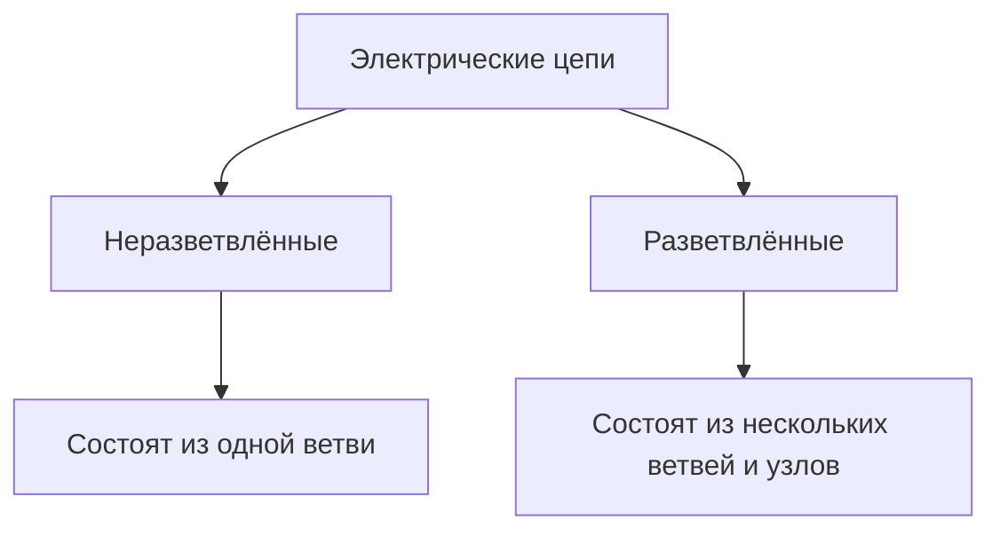

> [!info] **Ветвь ($в$)** 
> — участок электрической цепи, по элементам которого протекает один и тот же ток. В ветви протекает свой собственный ток, направление которого выбирается произвольно.

> [!info] **Узел ($у$)** 
> — место соединения трёх и более ветвей. Обозначается цифрами либо латинскими буквами.

> [!info] **Контур**
>  — замкнутый путь по ветвям электрической цепи. Контур характеризуется направлением обхода (по часовой стрелке или против), которое выбирается произвольно.

> [!info] **Независимый контур** 
> — контур, содержащий хотя бы одну ветвь, не входящую в другие выбранные контуры. Для расчётов используются только независимые контуры.

---

### Примеры топологических структур

#### 1. Неразветвлённая цепь
Состоит из одного замкнутого контура ($в = 1$, узлов с числом ветвей $\ge 3$ нет: $у = 0$).

```tikz
\begin{document}
\begin{tikzpicture}[scale=0.9]
  % Провода
  \draw (0,1.85) -- (0,3) -- (1.5,3);
  \draw (2.5,3) -- (4,3) -- (4,2.0);
  \draw (4,1.0) -- (4,0) -- (2.5,0);
  \draw (1.5,0) -- (0,0) -- (0,1.15);
  
  % Источник ЭДС E (кружок со стрелкой внутри)
  \draw (0,1.5) circle [radius=0.35];
  \draw[->, thick] (0,1.25) -- (0,1.75);
  \node[left] at (-0.4,1.5) {$E$};
  
  % Резистор R1
  \draw (1.5,2.75) rectangle (2.5,3.25);
  \node[above] at (2,3.3) {$R_1$};
  
  % Резистор R2
  \draw (3.75,1.0) rectangle (4.25,2.0);
  \node[right] at (4.3,1.5) {$R_2$};
  
  % Резистор R3
  \draw (1.5,-0.25) rectangle (2.5,0.25);
  \node[below] at (2,-0.3) {$R_3$};
  
  % Ток I
  \draw[->, thick] (0.6,3.3) -- (1.1,3.3) node[above] {$I$};
\end{tikzpicture}
\end{document}
```

---

#### 2. Разветвлённая цепь с двумя узлами (3 ветви: $у = 2$, $в = 3$)

```tikz
\begin{document}
\begin{tikzpicture}[scale=0.9]
  % Источник E в левой ветви
  \draw (0,0) -- (0,1.15);
  \draw (0,1.5) circle [radius=0.35];
  \draw[->, thick] (0,1.25) -- (0,1.75);
  \node[left] at (-0.4,1.5) {$E$};
  \draw (0,1.85) -- (0,3) -- (2,3);
  \draw (0,0) -- (2,0);
  
  % Общий ток I
  \draw[->, thick] (0.7,3.3) -- (1.3,3.3) node[above] {$I$};
  
  % Узлы 1 и 2
  \fill (2,3) circle (2pt) node[above] {1};
  \fill (2,0) circle (2pt) node[below] {2};
  \fill (4,3) circle (2pt);
  \fill (4,0) circle (2pt);
  \draw (2,3) -- (4,3);
  \draw (2,0) -- (4,0);
  
  % Ветвь с R1
  \draw (2,3) -- (2,2.0);
  \draw (1.75,1.0) rectangle (2.25,2.0);
  \node[left] at (1.7,1.5) {$R_1$};
  \draw (2,1.0) -- (2,0);
  \draw[->, thick] (2,2.6) -- (2,2.2) node[right] {$I_1$};
  
  % Ветвь с R2
  \draw (4,3) -- (4,2.0);
  \draw (3.75,1.0) rectangle (4.25,2.0);
  \node[right] at (4.3,1.5) {$R_2$};
  \draw (4,1.0) -- (4,0);
  \draw[->, thick] (4,2.6) -- (4,2.2) node[right] {$I_2$};
\end{tikzpicture}
\end{document}
```

---

#### 3. Разветвлённая цепь с двумя узлами (4 ветви: $у = 2$, $в = 4$)

> [!info] Понятие топологического узла
> На принципиальных схемах соединительные провода считаются идеальными (их сопротивление $R = 0$). 
> Поэтому все точки подключения на верхней шине имеют **одинаковый потенциал** ($\varphi_1$) и топологически стягиваются в **один Узел 1**. Аналогично, все точки подключения на нижней шине имеют потенциал ($\varphi_2$) и образуют **один Узел 2**.

```tikz
\begin{document}
\begin{tikzpicture}[scale=0.95]
  \draw (0,0) -- (0,1.15);
  \draw (0,1.5) circle [radius=0.35];
  \draw[->, thick] (0,1.25) -- (0,1.75);
  \node[left] at (-0.4,1.5) {$E$};
  \draw (0,1.85) -- (0,3) -- (2,3);
  \draw (0,0) -- (2,0);
  \draw[->, thick] (0.7,3.3) -- (1.3,3.3) node[above] {$I$};
  \draw[very thick, blue] (2,3) -- (5.6,3);
  \draw[very thick, blue] (2,0) -- (5.6,0);
  \fill[blue] (2,3) circle [radius=2pt] node[above] {$1'$};
  \fill[blue] (3.8,3) circle [radius=2pt] node[above] {$1''$};
  \fill[blue] (5.6,3) circle [radius=2pt] node[above] {$1'''$};
  \fill[blue] (2,0) circle [radius=2pt] node[below] {$2'$};
  \fill[blue] (3.8,0) circle [radius=2pt] node[below] {$2''$};
  \fill[blue] (5.6,0) circle [radius=2pt] node[below] {$2'''$};
  \draw[dashed, blue, rounded corners=4pt] (1.6,2.7) rectangle (6.8,3.6);
  \node[blue, right] at (6.8,3.15) {$\Rightarrow \mathbf{Node\ 1}~(\varphi_1)$};
  \draw[dashed, blue, rounded corners=4pt] (1.6,-0.6) rectangle (6.8,0.3);
  \node[blue, right] at (6.8,-0.15) {$\Rightarrow \mathbf{Node\ 2}~(\varphi_2)$};
  \draw (2,3) -- (2,2.0);
  \draw (1.75,1.0) rectangle (2.25,2.0);
  \node[left] at (1.7,1.5) {$R_1$};
  \draw (2,1.0) -- (2,0);
  \draw[->, thick] (2,2.5) -- (2,2.2) node[right] {$I_1$};
  \draw (3.8,3) -- (3.8,2.0);
  \draw (3.55,1.0) rectangle (4.05,2.0);
  \node[right] at (4.1,1.5) {$R_2$};
  \draw (3.8,1.0) -- (3.8,0);
  \draw[->, thick] (3.8,2.5) -- (3.8,2.2) node[right] {$I_2$};
  \draw (5.6,3) -- (5.6,2.0);
  \draw (5.35,1.0) rectangle (5.85,2.0);
  \node[right] at (5.9,1.5) {$R_3$};
  \draw (5.6,1.0) -- (5.6,0);
  \draw[->, thick] (5.6,2.5) -- (5.6,2.2) node[right] {$I_3$};
\end{tikzpicture}
\end{document}
```

---

### Пример: Преобразование «треугольник – звезда» ($\Delta \to \text{Y}$) в сложной мостовой цепи

### ==I. Изначальная схема==

> [!info] Расчёт мостовой схемы
> Если в мостовой цепи резисторы не образуют простых последовательных или параллельных участков, цепь упрощают эквивалентным преобразованием:
> * В исходной схеме выделяется замкнутый контур из трёх резисторов — **треугольник ($\Delta$)**.
> * Он заменяется трёхлучевой **звездой ($\text{Y}$)** с введением одного **дополнительного узла $A$**.
> * После этого схема сводится к элементарным смешанным (последовательно-параллельным) соединениям.

```tikz
\begin{document}
\begin{tikzpicture}[scale=1.05]
  % Координаты узлов
  \coordinate (N1) at (3.5, 5.5);
  \coordinate (N2) at (3.5, 2.8);
  \coordinate (N4) at (7.2, 2.8);
  \coordinate (N3) at (3.5, 0.0);
  \coordinate (NA) at (4.8, 3.8); % Доп. узел А внутри треугольника 1-2-4

  % Источник ЭДС E в левой ветви (между узлами 3 и 1)
  \draw (N3) -- (1.2, 0) -- (1.2, 2.4);
  \draw (1.2, 2.75) circle [radius=0.35];
  \draw[->, thick] (1.2, 2.5) -- (1.2, 3.0);
  \node[left=3pt] at (0.85, 2.75) {$E$};
  \draw (1.2, 3.1) -- (1.2, 5.5) -- (N1);
  \draw[->, thick] (1.8, 5.8) -- (2.6, 5.8) node[midway, above] {$I$};

  % --- Ветви исходного треугольника Δ (узлы 1, 2, 4) ---
  % Ветвь 1-2: R1
  \draw (N1) -- (3.5, 4.6);
  \draw[->, thick] (3.5, 5.2) -- (3.5, 4.7) node[midway, left=2pt] {$I_1$};
  \draw[fill=white] (3.25, 3.8) rectangle (3.75, 4.6);
  \node[left=3pt] at (3.25, 4.2) {$R_1$};
  \draw (3.5, 3.8) -- (N2);

  % Ветвь 1-4: R2
  \draw (N1) -- (7.2, 5.5) -- (7.2, 4.6);
  \draw[->, thick] (7.2, 5.2) -- (7.2, 4.7) node[midway, right=2pt] {$I_2$};
  \draw[fill=white] (6.95, 3.8) rectangle (7.45, 4.6);
  \node[right=3pt] at (7.45, 4.2) {$R_2$};
  \draw (7.2, 3.8) -- (N4);

  % Ветвь 2-4: R3 (перемычка моста)
  \draw (N2) -- (4.75, 2.8);
  \draw[fill=white] (4.75, 2.55) rectangle (5.75, 3.05);
  \node[above=3pt] at (5.25, 3.05) {$R_3$};
  \draw (5.75, 2.8) -- (N4);
  \draw[<-, thick] (4.8, 2.3) -- (5.7, 2.3) node[midway, below=1pt] {$I_3$};

  % --- Нижняя часть схемы ---
  % Ветвь 2-3: R4
  \draw (N2) -- (3.5, 2.0);
  \draw[->, thick] (3.5, 2.5) -- (3.5, 2.1) node[midway, left=2pt] {$I_4$};
  \draw[fill=white] (3.25, 1.0) rectangle (3.75, 1.8);
  \node[left=3pt] at (3.25, 1.4) {$R_4$};
  \draw (3.5, 1.0) -- (N3);

  % Ветвь 3-4: R5
  \draw (N3) -- (4.75, 0);
  \draw[fill=white] (4.75, -0.25) rectangle (5.75, 0.25);
  \node[below=3pt] at (5.25, -0.25) {$R_5$};
  \draw (5.75, 0) -- (7.2, 0) -- (N4);
  \draw[->, thick] (6.1, 0.35) -- (6.8, 0.35) node[midway, above=1pt] {$I_5$};

  % --- ЭКВИВАЛЕНТНАЯ ЗВЕЗДА Y (красная) ---
  \fill[red] (NA) circle (2pt) node[below=3pt, red] {$A$};
  
  % Луч A - 1
  \draw[red, thick, dashed] (N1) -- (4.3, 4.45);
  \draw[red, thick, fill=white, rotate around={-54:(4.15,4.65)}] (3.8,4.5) rectangle (4.5,4.8);
  \node[red, above right=2pt] at (4.2, 4.65) {$R_{12}$};
  \draw[red, thick, dashed] (4.0, 4.85) -- (NA);

  % Луч A - 2
  \draw[red, thick, dashed] (N2) -- (4.0, 3.2);
  \draw[red, thick, fill=white, rotate around={37:(4.15,3.3)}] (3.8,3.15) rectangle (4.5,3.45);
  \node[red, above left=1pt] at (4.1, 3.4) {$R_{13}$};
  \draw[red, thick, dashed] (4.3, 3.4) -- (NA);

  % Луч A - 4
  \draw[red, thick, dashed] (N4) -- (6.2, 3.2);
  \draw[red, thick, fill=white, rotate around={-23:(6.0,3.3)}] (5.65,3.15) rectangle (6.35,3.45);
  \node[red, above right=1pt] at (6.0, 3.4) {$R_{23}$};
  \draw[red, thick, dashed] (5.8, 3.4) -- (NA);

  % Узлы схемы (поверх проводников)
  \fill (N1) circle (2.5pt) node[above=2pt] {1};
  \fill (N2) circle (2.5pt) node[left=3pt] {2};
  \fill (N3) circle (2.5pt) node[below=2pt] {3};
  \fill (N4) circle (2.5pt) node[right=3pt] {4};
\end{tikzpicture}
\end{document}
```

#### Топологические параметры цепи:
* Число узлов: $у = 4$ (узлы 1, 2, 3, 4).
* Число ветвей: $в = 6$ (ветви с $E$, $R_1$, $R_2$, $R_3$, $R_4$, $R_5$).

---

### Эквивалентное преобразование «Треугольник $\leftrightarrow$ Звезда» ($\Delta \leftrightarrow \text{Y}$)

> [!info] Соединение треугольником ($\Delta$) и звездой ($\text{Y}$)
> * **Соединение звездой ($\text{Y}$):** соединение, при котором начала (или концы) элементов присоединены к одному общему узлу, а другие выводы подключены к трём раздельным узлам цепи.
> * **Соединение треугольником ($\Delta$):** соединение, при котором конец первого элемента в узле соединён с началом второго, конец второго — с началом третьего, а конец третьего — с началом первого.

```tikz
\begin{document}
\begin{tikzpicture}[scale=0.95]
  \coordinate (T1) at (0,3);
  \coordinate (T2) at (3,3);
  \coordinate (T3) at (1.5,0.4);
  \fill (T1) circle [radius=2pt] node[above left] {1};
  \fill (T2) circle [radius=2pt] node[above right] {2};
  \fill (T3) circle [radius=2pt] node[below] {3};
  \draw (T1) -- (0.9,3);
  \draw (0.9,2.75) rectangle (2.1,3.25);
  \node[above] at (1.5,3.3) {$R_{12}$};
  \draw (2.1,3) -- (T2);
  \draw (T2) -- (2.5,2.13);
  \draw[rotate around={60:(2.25,1.7)}] (1.75,1.45) rectangle (2.75,1.95);
  \node[right] at (2.4,1.7) {$R_{23}$};
  \draw (2.0,1.27) -- (T3);
  \draw (T3) -- (1.0,1.27);
  \draw[rotate around={-60:(0.75,1.7)}] (0.25,1.45) rectangle (1.25,1.95);
  \node[left] at (0.6,1.7) {$R_{31}$};
  \draw (0.5,2.13) -- (T1);
  \node at (1.5,1.8) {$\Delta$};
  \draw[<->, thick] (3.6,1.7) -- (4.6,1.7);
  \coordinate (S1) at (5.2,3);
  \coordinate (S2) at (8.2,3);
  \coordinate (S3) at (6.7,0.4);
  \coordinate (SA) at (6.7,2.0);
  \fill (S1) circle [radius=2pt] node[above left] {1};
  \fill (S2) circle [radius=2pt] node[above right] {2};
  \fill (S3) circle [radius=2pt] node[below] {3};
  \fill (SA) circle [radius=2pt] node[above] {$A$};
  \draw (S1) -- (5.65,2.7);
  \draw[rotate around={-33:(6.0,2.45)}] (5.5,2.2) rectangle (6.5,2.7);
  \node[below left] at (6.0,2.3) {$R_1$};
  \draw (6.35,2.2) -- (SA);
  \draw (S2) -- (7.75,2.7);
  \draw[rotate around={33:(7.4,2.45)}] (6.9,2.2) rectangle (7.9,2.7);
  \node[below right] at (7.4,2.3) {$R_2$};
  \draw (7.05,2.2) -- (SA);
  \draw (SA) -- (6.7,1.7);
  \draw (6.45,0.9) rectangle (6.95,1.7);
  \node[right] at (7.0,1.3) {$R_3$};
  \draw (6.7,0.9) -- (S3);
  \node at (5.7,0.8) {$Y$};
\end{tikzpicture}
\end{document}
```

#### Формулы перехода от треугольника к эквивалентной звезде ($\Delta \to \text{Y}$):
$$R_1 = \frac{R_{12} \cdot R_{31}}{R_{12} + R_{23} + R_{31}}$$
$$R_2 = \frac{R_{12} \cdot R_{23}}{R_{12} + R_{23} + R_{31}}$$
$$R_3 = \frac{R_{23} \cdot R_{31}}{R_{12} + R_{23} + R_{31}}$$

---

> [!info] Последовательное соединение элементов
> Если элементы находятся в одной ветви (то есть по ним протекает один и тот же ток), такие элементы соединены **последовательно**.
> $$R_{экв} = R_1 + R_2 + \dots + R_n$$
> *$R_{экв}$ — такое эквивалентное сопротивление, на которое можно заменить весь участок цепи, и ток через источник при этом не изменится.*

> [!info] Параллельное соединение элементов
> Если элементы присоединены к двум одинаковым узлам (то есть на них действует одно и то же напряжение), такие элементы соединены **параллельно**.
> 
> Расчёт через проводимость ($g = \dfrac{1}{R}$ $[См]$):
> $$g_{экв} = g_1 + g_2 + \dots + g_n$$

---

### ==II. Свёртывание мостовой схемы после замены $\Delta \to \text{Y}$==

После того как исходный треугольник сопротивлений заменён эквивалентной звездой (с дополнительным узлом $A$ и лучами $R_{12}, R_{13}, R_{23}$), схема принимает вид двух параллельных ветвей, подключённых к узлу $A$:

```tikz
\begin{document}
\begin{tikzpicture}[scale=1.0]
  % --- СХЕМА ПОСЛЕ ПРЕОБРАЗОВАНИЯ В ЗВЕЗДУ ---
  % Источник ЭДС E
  \draw (0, 0) -- (0, 1.4);
  \draw (0, 1.75) circle [radius=0.35];
  \draw[->, thick] (0, 1.5) -- (0, 2.0);
  \node[left=3pt] at (-0.35, 1.75) {$E$};
  \draw (0, 2.1) -- (0, 3.5) -- (1.6, 3.5);

  % Резистор R12
  \draw[fill=white] (1.6, 3.25) rectangle (2.6, 3.75);
  \node[above=3pt] at (2.1, 3.75) {$R_{12}$};
  \draw (2.6, 3.5) -- (3.3, 3.5);

  % Дополнительный узел A
  \fill[red] (3.3, 3.5) circle (2.5pt) node[above=2pt, red] {$A$};

  % Разветвление от узла A на две параллельные ветви
  \draw (3.3, 3.5) -- (3.3, 3.0) -- (2.3, 3.0) -- (2.3, 2.7);
  \draw (3.3, 3.0) -- (4.3, 3.0) -- (4.3, 2.7);

  % Левая параллельная ветвь: R13 -> узел 2 -> R4
  \draw[fill=white] (2.05, 1.9) rectangle (2.55, 2.7);
  \node[left=3pt] at (2.05, 2.3) {$R_{13}$};
  \draw (2.3, 1.9) -- (2.3, 1.6);
  \fill (2.3, 1.4) circle (2pt) node[left=3pt] {2};
  \draw (2.3, 1.6) -- (2.3, 1.2);
  \draw[fill=white] (2.05, 0.4) rectangle (2.55, 1.2);
  \node[left=3pt] at (2.05, 0.8) {$R_4$};
  \draw (2.3, 0.4) -- (2.3, 0);

  % Правая параллельная ветвь: R23 -> узел 3 -> R5
  \draw[fill=white] (4.05, 1.9) rectangle (4.55, 2.7);
  \node[right=3pt] at (4.55, 2.3) {$R_{23}$};
  \draw (4.3, 1.9) -- (4.3, 1.6);
  \fill (4.3, 1.4) circle (2pt) node[right=3pt] {3};
  \draw (4.3, 1.6) -- (4.3, 1.2);
  \draw[fill=white] (4.05, 0.4) rectangle (4.55, 1.2);
  \node[right=3pt] at (4.55, 0.8) {$R_5$};
  \draw (4.3, 0.4) -- (4.3, 0);

  % Нижний провод (замыкание цепи)
  \draw (2.3, 0) -- (4.3, 0);
  \draw (2.3, 0) -- (0, 0);

  % --- СТРЕЛКА СВЁРТЫВАНИЯ СХЕМЫ ---
  \draw[->, very thick] (5.2, 1.75) -- (6.1, 1.75);

  % --- ФИНАЛЬНАЯ ЭКВИВАЛЕНТНАЯ СХЕМА ---
  \begin{scope}[xshift=7.0cm]
    \draw (0, 0) -- (0, 1.4);
    \draw (0, 1.75) circle [radius=0.35];
    \draw[->, thick] (0, 1.5) -- (0, 2.0);
    \node[left=3pt] at (-0.35, 1.75) {$E$};
    \draw (0, 2.1) -- (0, 3.5) -- (1.8, 3.5) -- (1.8, 2.3);

    % Эквивалентное сопротивление Rэкв
    \draw[fill=white] (1.5, 1.1) rectangle (2.1, 2.3);
    \node[right=4pt] at (2.1, 1.7) {$R_{eqv}$};

    \draw (1.8, 1.1) -- (1.8, 0) -- (0, 0);
  \end{scope}
\end{tikzpicture}
\end{document}
```

#### Формула эквивалентного сопротивления цепи:
$$R_{экв} = R_{12} + \frac{1}{\dfrac{1}{R_{13} + R_4} + \dfrac{1}{R_{23} + R_5}}$$

---
# Закон Ома и эквивалентные сопротивления

### Закон Ома для пассивного участка цепи (не содержит источников)

$$I = \frac{\varphi_1 - \varphi_2}{R} = \frac{U_{12}}{R}$$

```tikz
\begin{document}
\begin{tikzpicture}[scale=0.9]
  \draw (0,0) -- (1,0);
  \draw (1,-0.25) rectangle (2.5,0.25);
  \node at (1.75,0) {$R$};
  \draw (2.5,0) -- (3.5,0);
  
  \fill (0,0) circle (2pt) node[left] {1};
  \fill (3.5,0) circle (2pt) node[right] {2};
  
  \draw[->, thick] (0.3,0.35) -- (0.8,0.35) node[above] {$I$};
  \draw[->] (0.5,-0.6) -- (3.0,-0.6) node[midway, below] {$U_{12}$};
\end{tikzpicture}
\end{document}
```

---

### Закон Ома для активного участка цепи (содержит ЭДС)

$$I = \frac{\varphi_1 - \varphi_2 + \sum E}{R_1 + R_2} = \frac{\varphi_1 - \varphi_2 + E_1 - E_2}{R_1 + R_2}$$

```tikz
\begin{document}
\begin{tikzpicture}[scale=0.9]
  \fill (0,0) circle (2pt) node[left] {1};
  \draw (0,0) -- (0.8,0);
  
  % Резистор R1
  \draw (0.8,-0.25) rectangle (2.0,0.25);
  \node at (1.4,0) {$R_1$};
  \draw (2.0,0) -- (2.55,0);
  
  % Источник E1 (направлен вправо)
  \draw (2.9,0) circle [radius=0.35];
  \draw[->, thick] (2.65,0) -- (3.15,0);
  \node[above] at (2.9,0.4) {$E_1$};
  \draw (3.25,0) -- (3.8,0);
  
  % Резистор R2
  \draw (3.8,-0.25) rectangle (5.0,0.25);
  \node at (4.4,0) {$R_2$};
  \draw (5.0,0) -- (5.55,0);
  
  % Источник E2 (направлен влево)
  \draw (5.9,0) circle [radius=0.35];
  \draw[<-, thick] (5.65,0) -- (6.15,0);
  \node[above] at (5.9,0.4) {$E_2$};
  \draw (6.25,0) -- (7.0,0);
  
  \fill (7.0,0) circle (2pt) node[right] {2};
  
  % Ток и напряжение
  \draw[->, thick] (0.2,0.4) -- (0.6,0.4) node[above] {$I$};
  \draw[->] (0.5,-0.7) -- (6.5,-0.7) node[midway, below] {$U_{12}$};
\end{tikzpicture}
\end{document}
```

> [!warning] Правило знаков для ЭДС
> Если направление стрелки источника ЭДС $E$ совпадает с выбранным направлением тока $I$, то ЭДС берётся со знаком $(+)$; если направлена навстречу току — со знаком $(-)$.

---

# Закон Ома и эквивалентные сопротивления

> [!tldr] Базовые соотношения закона Ома
> $$\mathbf{I = \frac{U}{R}} \qquad\Longleftrightarrow\qquad \mathbf{U = I \cdot R} \qquad\Longleftrightarrow\qquad \mathbf{R = \frac{U}{I}}$$
> *Напряжение (разность потенциалов):* $U_{12} = \varphi_1 - \varphi_2\ [\text{В}]$.

---

## 1. Закон Ома для участка цепи

### 1) Пассивный участок (ток от узла 1 к узлу 2)
Участок не содержит источников ЭДС. Ток течёт от точки с большим потенциалом $\varphi_1$ к точке с меньшим потенциалом $\varphi_2$:

```tikz
\begin{document}
\begin{tikzpicture}[scale=1.0]
  \fill (0,0) circle (2pt) node[left=3pt] {1};
  \draw (0,0) -- (1.0,0);
  
  \draw[fill=white] (1.0,-0.25) rectangle (2.2,0.25);
  \node at (1.6,0) {$R$};
  
  \draw (2.2,0) -- (3.2,0);
  \fill (3.2,0) circle (2pt) node[right=3pt] {2};
  
  \draw[->, thick] (0.3,0.35) -- (0.8,0.35) node[midway, above] {$I$};
  \draw[->] (0.5,-0.6) -- (2.7,-0.6) node[midway, below] {$U$};
\end{tikzpicture}
\end{document}
```

$$I = \frac{\varphi_1 - \varphi_2}{R} = \frac{U_{12}}{R}$$

---

### 2) Пассивный участок (ток в обратном направлении — от узла 2 к узлу 1)
Если ток направлен от узла 2 к узлу 1 через последовательно включённые резисторы $R_1$ и $R_2$, потенциал $\varphi_2 > \varphi_1$:

```tikz
\begin{document}
\begin{tikzpicture}[scale=1.0]
  \fill (0,0) circle (2pt) node[left=3pt] {1};
  \draw (0,0) -- (0.8,0);
  
  \draw[fill=white] (0.8,-0.25) rectangle (1.8,0.25);
  \node at (1.3,0) {$R_1$};
  \draw (1.8,0) -- (2.6,0);
  
  \draw[fill=white] (2.6,-0.25) rectangle (3.6,0.25);
  \node at (3.1,0) {$R_2$};
  \draw (3.6,0) -- (4.4,0);
  
  \fill (4.4,0) circle (2pt) node[right=3pt] {2};
  
  % Стрелка тока влево (от 2 к 1)
  \draw[<-, thick] (3.8,0.35) -- (4.3,0.35) node[midway, above] {$I$};
  % Стрелка напряжения влево (U21)
  \draw[<-] (0.5,-0.6) -- (3.9,-0.6) node[midway, below] {$U$};
\end{tikzpicture}
\end{document}
```

$$I = \frac{\varphi_2 - \varphi_1}{R_1 + R_2} \qquad \text{(разность потенциалов берётся в направлении тока)}$$

---

### 3) Параллельный участок цепи
Две параллельные ветви подключены к узлам 1 и 2. Напряжение на обеих ветвях одинаково и равно $U_{12} = \varphi_1 - \varphi_2$:

```tikz
\begin{document}
\begin{tikzpicture}[scale=1.0]
  \draw (0,1.5) -- (0.8,1.5);
  \fill (0.8,1.5) circle (2pt) node[above left] {1};
  
  % Верхняя ветвь (R1)
  \draw (0.8,1.5) -- (0.8,2.2) -- (1.5,2.2);
  \draw[fill=white] (1.5,1.95) rectangle (2.5,2.45);
  \node at (2.0,2.2) {$R_1$};
  \draw (2.5,2.2) -- (3.2,2.2) -- (3.2,1.5);
  \draw[->, thick] (1.0,2.4) -- (1.4,2.4) node[midway, above] {$I_1$};
  
  % Нижняя ветвь (R2)
  \draw (0.8,1.5) -- (0.8,0.8) -- (1.5,0.8);
  \draw[fill=white] (1.5,0.55) rectangle (2.5,1.05);
  \node at (2.0,0.8) {$R_2$};
  \draw (2.5,0.8) -- (3.2,0.8) -- (3.2,1.5);
  \draw[->, thick] (1.0,0.6) -- (1.4,0.6) node[midway, below] {$I_2$};
  
  \fill (3.2,1.5) circle (2pt) node[above right] {2};
  \draw (3.2,1.5) -- (4.0,1.5);
  
  % Стрелка общего напряжения U12
  \draw[->] (1.1,1.5) -- (2.9,1.5) node[midway, below=-1pt] {$U_{12}$};
\end{tikzpicture}
\end{document}
```

$$I_1 = \frac{U_{12}}{R_1}, \qquad I_2 = \frac{U_{12}}{R_2}$$

---

### 4) Активный участок цепи (содержит источники ЭДС)
Участок содержит сопротивления и источники ЭДС. Ток $I$ течёт от узла 1 к узлу 2:

```tikz
\begin{document}
\begin{tikzpicture}[scale=1.0]
  \fill (0,0) circle (2pt) node[left=3pt] {1};
  \draw (0,0) -- (0.6,0);
  
  % R1
  \draw[fill=white] (0.6,-0.25) rectangle (1.6,0.25);
  \node at (1.1,0) {$R_1$};
  \draw (1.6,0) -- (2.15,0);
  
  % E1 (направлен вправо, совпадает с током)
  \draw (2.5,0) circle [radius=0.35];
  \draw[->, thick] (2.25,0) -- (2.75,0);
  \node[above=3pt] at (2.5,0.35) {$E_1$};
  \draw (2.85,0) -- (3.4,0);
  
  % R2
  \draw[fill=white] (3.4,-0.25) rectangle (4.4,0.25);
  \node at (3.9,0) {$R_2$};
  \draw (4.4,0) -- (4.95,0);
  
  % E2 (направлен влево, навстречу току)
  \draw (5.3,0) circle [radius=0.35];
  \draw[<-, thick] (5.05,0) -- (5.55,0);
  \node[above=3pt] at (5.3,0.35) {$E_2$};
  \draw (5.65,0) -- (6.3,0);
  
  \fill (6.3,0) circle (2pt) node[right=3pt] {2};
  
  % Ток и напряжение
  \draw[->, thick] (0.1,0.35) -- (0.5,0.35) node[midway, above] {$I$};
  \draw[->] (0.4,-0.65) -- (5.9,-0.65) node[midway, below] {$U_{12}$};
\end{tikzpicture}
\end{document}
```

Общая формула:
$$I = \frac{\varphi_1 - \varphi_2 + \sum\limits_{k=1}^n E_k}{R_{экв}}$$

Для приведённой схемы:
$$I = \frac{\varphi_1 - \varphi_2 + E_1 - E_2}{R_1 + R_2}$$

> [!warning] Правило знаков для источников ЭДС
> * Если стрелка ЭДС внутри источника направлена **по току** $\implies$ ставится знак $(+E_1)$.
> * Если стрелка ЭДС направлена **против тока** $\implies$ ставится знак $(-E_2)$.

---

## 2. Закон Ома для полной (замкнутой) цепи

Цепь содержит источник с ЭДС $E$ и внутренним сопротивлением $r_0$, нагруженный на внешнее сопротивление $R_н$:

```tikz
\begin{document}
\begin{tikzpicture}[scale=1.0]
  % Источник ЭДС E
  \draw (0,0) -- (0,1.9);
  \draw (0,2.25) circle [radius=0.35];
  \draw[->, thick] (0,2.0) -- (0,2.5);
  \node[left=3pt] at (-0.35,2.25) {$E$};
  \draw (0,2.6) -- (0,3.5) -- (3.0,3.5);
  
  % Ток цепи
  \draw[->, thick] (1.2,3.8) -- (1.8,3.8) node[midway, above] {$I$};
  
  % Внутреннее сопротивление r0
  \draw (0,0) -- (0,0.6);
  \draw[fill=white] (-0.25,0.6) rectangle (0.25,1.4);
  \node[left=3pt] at (-0.25,1.0) {$r_0$};
  \draw (0,1.4) -- (0,1.9);
  
  % Нагрузка Rn
  \draw (3.0,3.5) -- (3.0,2.3);
  \draw[fill=white] (2.75,1.1) rectangle (3.25,2.3);
  \node[right=3pt] at (3.25,1.7) {$R_n$};
  \draw (3.0,1.1) -- (3.0,0) -- (0,0);
\end{tikzpicture}
\end{document}
```

$$I = \frac{E}{r_0 + R_н} = \frac{E}{R_{экв}}$$

---

## 3. Пример расчёта цепи методом свёртывания (эквивалентных преобразований)

> [!info] Постановка задачи
> **Дано:** параметры источников и резисторов цепи: $E, R_1, R_2, R_3, R_4$.  
> **Найти:** токи во всех ветвях цепи: $I_1, I_2, I_3 = ?$.

Параллельный участок между узлами 1 и 2 содержит:
* узлов: $у = 2$;
* ветвей: $в = 3$.

```tikz
\begin{document}
\begin{tikzpicture}[scale=0.95]
  % --- ИСХОДНАЯ СХЕМА ---
  \draw (0,0) -- (0,1.65);
  \draw (0,2.0) circle [radius=0.35];
  \draw[->, thick] (0,1.75) -- (0,2.25);
  \node[left=3pt] at (-0.35,2.0) {$E$};
  \draw (0,2.35) -- (0,3.5) -- (1.0,3.5);
  
  % Резистор R1
  \draw[fill=white] (1.0,3.25) rectangle (2.0,3.75);
  \node[above=3pt] at (1.5,3.75) {$R_1$};
  \draw (2.0,3.5) -- (3.0,3.5);
  \draw[->, thick] (0.4,3.8) -- (0.8,3.8) node[midway, above] {$I_1$};
  
  % Узлы 1 и 2
  \fill (3.0,3.5) circle (2pt) node[above left] {1};
  \fill (3.0,0) circle (2pt) node[below left] {2};
  \draw (0,0) -- (3.0,0);
  
  % Ветвь с (R2 + R4)
  \draw (3.0,3.5) -- (3.0,2.8) -- (3.6,2.8);
  \draw[fill=white] (3.6,2.55) rectangle (4.4,3.05);
  \node[above=2pt] at (4.0,3.05) {$R_2$};
  \draw (4.4,2.8) -- (4.8,2.8);
  \draw[fill=white] (4.8,2.55) rectangle (5.6,3.05);
  \node[above=2pt] at (5.2,3.05) {$R_4$};
  \draw (5.6,2.8) -- (6.2,2.8) -- (6.2,0);
  \draw[->, thick] (5.8,3.1) -- (6.1,3.1) node[midway, above] {$I_2$};
  
  % Ветвь с R3
  \draw (3.0,3.5) -- (3.0,0.9) -- (4.1,0.9);
  \draw[fill=white] (4.1,0.65) rectangle (5.1,1.15);
  \node[above=2pt] at (4.6,1.15) {$R_3$};
  \draw (5.1,0.9) -- (6.2,0.9);
  \draw[->, thick] (3.3,0.6) -- (3.8,0.6) node[midway, below] {$I_3$};
  \draw (6.2,0) -- (3.0,0);
  
  % Контур R*
  \draw[dashed, red, rounded corners=6pt] (2.7, -0.4) rectangle (6.6, 3.3);
  \node[red, above right] at (6.6, 2.5) {$R^*$};
  
  % Стрелка перехода к эквивалентной схеме
  \draw[->, very thick] (7.1, 1.75) -- (7.9, 1.75);
  
  % --- ЭКВИВАЛЕНТНАЯ СХЕМА С R* ---
  \begin{scope}[xshift=8.5cm]
    \draw (0,0) -- (0,1.65);
    \draw (0,2.0) circle [radius=0.35];
    \draw[->, thick] (0,1.75) -- (0,2.25);
    \node[left=3pt] at (-0.35,2.0) {$E$};
    \draw (0,2.35) -- (0,3.5) -- (0.8,3.5);
    
    % R1
    \draw[fill=white] (0.8,3.25) rectangle (1.8,3.75);
    \node[above=3pt] at (1.3,3.75) {$R_1$};
    \draw (1.8,3.5) -- (2.6,3.5);
    \draw[->, thick] (0.3,3.8) -- (0.7,3.8) node[midway, above] {$I_1$};
    
    \fill (2.6,3.5) circle (2pt) node[above right] {1};
    \fill (2.6,0) circle (2pt) node[below right] {2};
    
    % Блок R*
    \draw (2.6,3.5) -- (2.6,2.4);
    \draw[fill=white] (2.35,1.1) rectangle (2.85,2.4);
    \node[right=3pt] at (2.85,1.75) {$R^*$};
    \draw (2.6,1.1) -- (2.6,0) -- (0,0);
    
    % Напряжение U21
    \draw[->] (2.1,2.8) -- (2.1,0.7) node[midway, left] {$U_{21}$};
  \end{scope}
\end{tikzpicture}
\end{document}
```

### Порядок расчёта:

1. **Эквивалентное сопротивление параллельного блока $R^*$:**
   Ветвь с $(R_2 + R_4)$ включена параллельно ветви с $R_3$:
   $$R^* = \frac{1}{\dfrac{1}{R_2 + R_4} + \dfrac{1}{R_3}} = \frac{(R_2 + R_4) \cdot R_3}{(R_2 + R_4) + R_3}$$

2. **Полное эквивалентное сопротивление цепи:**
   Резистор $R_1$ и блок $R^*$ соединены последовательно:
   $$R_{экв} = R_1 + R^*$$

3. **Общий ток цепи (ток через источник):**
   $$I_1 = \frac{E}{R_{экв}}$$

4. **Межузловое напряжение на параллельном блоке $R^*$:**
   $$U_{21} = I_1 \cdot R^*$$

5. **Токи в параллельных ветвях:**
   $$I_2 = \frac{U_{21}}{R_2 + R_4}, \qquad I_3 = \frac{U_{21}}{R_3}$$
# Законы Кирхгофа

### I Закон Кирхгофа (для узлов)

> [!info] Первый закон Кирхгофа
> В любом узле электрической цепи алгебраическая сумма токов равна нулю:
> $$\sum_{k=1}^n I_k = 0$$
> 
> * Ток, направленный **к узлу**, записывается со знаком $(+)$.
> * Ток, направленный **от узла**, записывается со знаком $(-)$.
> 
> Иными словами:
> $$\sum I_{входящие} = \sum I_{выходящие}$$

```tikz
\begin{document}
\begin{tikzpicture}[scale=0.95]
  \fill (0,0) circle (2.5pt) node[below left] {1};
  \draw[<-, thick] (0,0) -- (-1.8,1.2) node[above left] {$I_1$};
  \draw[->, thick] (0,0) -- (1.8,1.2) node[above right] {$I_2$};
  \draw[->, thick] (0,0) -- (1.8,-1.0) node[below right] {$I_3$};
  \draw[->, thick] (0,0) -- (-0.6,-1.5) node[below] {$I_4$};
\end{tikzpicture}
\end{document}
```

$$I_1 - I_2 - I_3 - I_4 = 0 \implies I_1 = I_2 + I_3 + I_4$$

> [!tldr] Число уравнений по I З.К.
> $$K_{I\text{ З.К.}} = у - 1$$
> где $у$ — число узлов в цепи.

---

### II Закон Кирхгофа (для замкнутых контуров)

> [!info] Второй закон Кирхгофа
> В замкнутом контуре электрической цепи алгебраическая сумма падений напряжений равна алгебраической сумме ЭДС в этом же контуре:
> $$\sum_{k=1}^n I_k R_k = \sum_{k=1}^m E_k$$

> [!warning] Правило знаков при обходе контура
> 1. Если направление тока в ветви **совпадает** с направлением обхода контура, то падение напряжения $I_k R_k$ записывается со знаком $(+)$, если противоположно — со знаком $(-)$.
> 2. ЭДС $E_k$ учитывается со знаком $(+)$, если её направление **совпадает** с направлением обхода контура, иначе со знаком $(-)$.

```tikz
\begin{document}
\begin{tikzpicture}[scale=1.05]
  \coordinate (N1) at (0, 3.5);
  \coordinate (N4) at (5.0, 3.5);
  \coordinate (N3) at (5.0, 0);
  \coordinate (N2) at (0, 0);
  \draw (N1) -- (N4);
  \draw (N4) -- (5.0, 2.8);
  \draw[fill=white] (4.75, 2.0) rectangle (5.25, 2.8);
  \node[right=4pt] at (5.25, 2.4) {$R_2$};
  \draw (5.0, 2.0) -- (5.0, 1.35);
  \draw (5.0, 1.0) circle [radius=0.35];
  \draw[->, thick] (5.0, 1.25) -- (5.0, 0.75);
  \node[right=4pt] at (5.35, 1.0) {$E_2$};
  \draw (5.0, 0.65) -- (N3);
  \draw[->, thick] (6.0, 2.7) -- (6.0, 1.8) node[midway, right=2pt] {$I_2$};
  \draw (N3) -- (3.65, 0);
  \draw (3.3, 0) circle [radius=0.35];
  \draw[->, thick] (3.55, 0) -- (3.05, 0);
  \node[above=4pt] at (3.3, 0.35) {$E_3$};
  \draw (2.95, 0) -- (2.2, 0);
  \draw[fill=white] (1.3, -0.25) rectangle (2.2, 0.25);
  \node[above=4pt] at (1.75, 0.25) {$R_3$};
  \draw (1.3, 0) -- (N2);
  \draw[->, thick] (2.9, -0.65) -- (2.0, -0.65) node[midway, below=2pt] {$I_3$};
  \draw (N2) -- (0, 0.65);
  \draw (0, 1.0) circle [radius=0.35];
  \draw[->, thick] (0, 1.25) -- (0, 0.75);
  \node[right=4pt] at (0.35, 1.0) {$E_4$};
  \draw (0, 1.35) -- (0, 2.0);
  \draw[fill=white] (-0.25, 2.0) rectangle (0.25, 2.8);
  \node[right=4pt] at (0.25, 2.4) {$R_4$};
  \draw (0, 2.8) -- (N1);
  \draw[->, thick] (-0.9, 1.8) -- (-0.9, 2.7) node[midway, left=2pt] {$I_4$};
  \draw[->, red, thick] (2.85, 2.05) arc (45:-270:0.5);
  \fill (N1) circle [radius=2pt] node[above left=2pt] {1};
  \fill (N4) circle [radius=2pt] node[above right=2pt] {4};
  \fill (N3) circle [radius=2pt] node[below right=2pt] {3};
  \fill (N2) circle [radius=2pt] node[below left=2pt] {2};
\end{tikzpicture}
\end{document}
```

Уравнение для данного контура (направление обхода по часовой стрелке):
$$-I_4 R_4 + I_3 R_3 - I_2 R_2 = E_3 - E_4 - E_2$$

> [!tldr] Число уравнений по II З.К.
> $$K_{II\text{ З.К.}} = в - в_J - (у - 1)$$
> где:
> * $в$ — общее число ветвей цепи;
> * $в_J$ — число ветвей с источниками тока;
> * $у$ — общее число узлов.

---

##  Пример расчёта цепи по законам Кирхгофа (Типовой расчёт / ДЗ №1)

### Схема электрической цепи

```tikz
\begin{document}
\begin{tikzpicture}[scale=1.0]
  % Координаты узлов схемы
  \coordinate (N1) at (3.0, 5.0);
  \coordinate (N2) at (7.5, 5.0);
  \coordinate (N3) at (10.0, 2.2);
  \coordinate (N4) at (6.0, 0.0);
  \coordinate (N5) at (0.0, 2.2);

  % --- Внешний верхний контур (ветвь 1-2 с E1 и R1) ---
  \draw (N1) -- (3.0, 7.2) -- (4.6, 7.2);
  \draw (5.0, 7.2) circle [radius=0.35];
  \draw[->, thick] (4.75, 7.2) -- (5.25, 7.2);
  \node[above=3pt] at (5.0, 7.55) {$E_1$};
  \draw (5.35, 7.2) -- (7.5, 7.2) -- (7.5, 6.4);
  \draw[fill=white] (7.25, 5.6) rectangle (7.75, 6.4);
  \node[right=4pt] at (7.75, 6.0) {$R_1$};
  \draw (7.5, 5.6) -- (N2);
  \draw[->, thick] (3.6, 7.5) -- (4.3, 7.5) node[midway, above=1pt] {$I_1$};

  % --- Ветвь 1-2 (с R2) ---
  \draw (N1) -- (4.6, 5.0);
  \draw[fill=white] (4.6, 4.75) rectangle (5.8, 5.25);
  \node[above=3pt] at (5.2, 5.25) {$R_2$};
  \draw (5.8, 5.0) -- (N2);
  \draw[->, thick] (3.6, 4.6) -- (4.3, 4.6) node[midway, below=1pt] {$I_2$};

  % --- Ветвь 2-3 (с E3 и R3) ---
  \draw (N2) -- (8.0, 4.1);
  \draw (8.25, 3.8) circle [radius=0.35];
  \draw[->, thick] (8.1, 4.0) -- (8.4, 3.6);
  \node[above right=3pt] at (8.5, 3.9) {$E_3$};
  \draw (8.5, 3.5) -- (8.85, 3.15);
  \draw[fill=white, rotate around={-48:(9.15, 2.85)}] (8.75, 2.65) rectangle (9.55, 3.05);
  \node[above right=3pt] at (9.3, 2.9) {$R_3$};
  \draw (9.45, 2.55) -- (N3);
  \draw[->, thick] (7.4, 4.3) -- (7.8, 3.8) node[midway, below left=1pt] {$I_3$};

  % --- Ветвь 3-4 (с R4) ---
  \draw (N3) -- (8.4, 1.35);
  \draw[fill=white, rotate around={29:(7.9, 1.05)}] (7.45, 0.85) rectangle (8.35, 1.25);
  \node[below right=3pt] at (8.0, 0.95) {$R_4$};
  \draw (7.4, 0.75) -- (N4);
  \draw[->, thick] (9.3, 1.5) -- (8.7, 1.15) node[midway, above right=1pt] {$I_4$};

  % --- Ветвь 4-1 (с R5) ---
  \draw (N4) -- (4.8, 2.0);
  \draw[fill=white, rotate around={-59:(4.5, 2.5)}] (4.05, 2.3) rectangle (4.95, 2.7);
  \node[above right=2pt] at (4.7, 2.6) {$R_5$};
  \draw (4.2, 3.0) -- (N1);
  \draw[->, thick] (5.4, 1.0) -- (4.95, 1.75) node[midway, below left=1pt] {$I_5$};

  % --- Ветвь 1-5 (с R6) ---
  \draw (N1) -- (1.8, 3.9);
  \draw[fill=white, rotate around={43:(1.5, 3.6)}] (1.05, 3.4) rectangle (1.95, 3.8);
  \node[above left=2pt] at (1.4, 3.8) {$R_6$};
  \draw (1.2, 3.3) -- (N5);
  \draw[->, thick] (2.5, 4.8) -- (2.0, 4.3) node[midway, below left=1pt] {$I_6$};

  % --- Ветвь 5-4 (с R7) ---
  \draw (N5) -- (2.4, 1.35);
  \draw[fill=white, rotate around={-20:(2.9, 1.15)}] (2.45, 0.95) rectangle (3.35, 1.35);
  \node[below=3pt] at (2.9, 0.95) {$R_7$};
  \draw (3.4, 0.95) -- (N4);
  \draw[->, thick] (1.0, 1.6) -- (1.7, 1.35) node[midway, above=1pt] {$I_7$};

  % --- Источник тока Jk1 (между узлами 1 и 5 по внешней дуге) ---
  \draw (N1) to[out=160, in=75] (0.8, 4.6);
  \draw (0.8, 4.6) circle [radius=0.4];
  % Две стрелки вдоль центральной линии внутри круга (от узла 1 к узлу 5)
  \begin{scope}[shift={(0.8, 4.6)}, rotate=220]
    \draw[->, thick] (0, -0.28) -- (0, 0.3);
    \draw[->, thick] (0, -0.28) -- (0, 0.12);
  \end{scope}
  \node[above left=2pt] at (0.8, 5.0) {$J_{k1}$};
  \draw (0.8, 4.6) to[out=255, in=120] (N5);

  % --- Источник тока Jk2 (между узлами 1 и 3 по внутренней дуге) ---
  \draw (N1) to[out=-25, in=145] (6.4, 3.4);
  \draw (6.4, 3.4) circle [radius=0.4];
  % Две стрелки вдоль центральной линии внутри круга (от узла 1 к узлу 3)
  \begin{scope}[shift={(6.4, 3.4)}, rotate=-40]
    \draw[->, thick] (0, -0.28) -- (0, 0.3);
    \draw[->, thick] (0, -0.28) -- (0, 0.12);
  \end{scope}
  \node[above right=2pt] at (6.6, 3.7) {$J_{k2}$};
  \draw (6.4, 3.4) to[out=-35, in=170] (N3);

  % --- Узлы схемы (поверх линий) ---
  \fill (N1) circle (2.5pt) node[below=3pt] {1};
  \fill (N2) circle (2.5pt) node[below right=2pt] {2};
  \fill (N3) circle (2.5pt) node[right=3pt] {3};
  \fill (N4) circle (2.5pt) node[below=3pt] {4};
  \fill (N5) circle (2.5pt) node[left=3pt] {5};

  % --- Контуры (направления обхода) ---
  \draw[->, red, thick] (5.3, 6.2) arc (45:-270:0.35);
  \node[red] at (5.0, 6.2) {I};

  \draw[->, red, thick] (6.8, 2.3) arc (45:-270:0.35);
  \node[red] at (6.5, 2.3) {II};

  \draw[->, red, thick] (3.0, 2.4) arc (45:-270:0.35);
  \node[red] at (2.7, 2.4) {III};
\end{tikzpicture}
\end{document}
```

---

### 1. Топологический анализ
* Число узлов: $у = 5$ (узлы 1, 2, 3, 4, 5).
* Число ветвей: $в = 9$.
* Число ветвей с источниками тока: $в_J = 2$ (ветви с $J_{k1}$ и $J_{k2}$).
* Число неизвестных токов: $в - в_J = 9 - 2 = 7$ (токи $I_1, I_2, I_3, I_4, I_5, I_6, I_7$).

---

### 2. Подсчёт необходимого количества уравнений
* **По I закону Кирхгофа:**
  $$K_{I\text{ З.К.}} = у - 1 = 5 - 1 = 4\text{ уравнения}$$
* **По II закону Кирхгофа:**
  $$K_{II\text{ З.К.}} = в - в_J - (у - 1) = 9 - 2 - 5 + 1 = 3\text{ уравнения}$$
* **Всего уравнений в системе:** $4 + 3 = 7$.

---

### 3. Составление уравнений системы

#### По I закону Кирхгофа (для узлов 1, 2, 3, 4):
$$\begin{cases}
\text{Узел 1:} & I_2 + I_5 - I_6 - J_{k1} - J_{k2} = 0 \\
\text{Узел 2:} & I_1 - I_2 - I_3 = 0 \\
\text{Узел 3:} & I_3 + I_4 + J_{k2} = 0 \\
\text{Узел 4:} & -I_4 - I_5 + I_7 = 0
\end{cases}$$

#### По II закону Кирхгофа (для трёх независимых контуров I, II, III):
$$\begin{cases}
\text{Контур I:} & I_1 R_1 + I_2 R_2 + I_6 R_6 = E_1 \\
\text{Контур II:} & -I_2 R_2 + I_3 R_3 - I_4 R_4 + I_5 R_5 = E_3 \\
\text{Контур III:} & -I_6 R_6 - I_5 R_5 - I_7 R_7 = 0
\end{cases}$$

---

### 4. Матричная форма записи системы линейных уравнений

$$\begin{pmatrix}
0 & 1 & 0 & 0 & 1 & -1 & 0 \\
1 & -1 & -1 & 0 & 0 & 0 & 0 \\
0 & 0 & 1 & 1 & 0 & 0 & 0 \\
0 & 0 & 0 & -1 & -1 & 0 & 1 \\
R_1 & R_2 & 0 & 0 & 0 & R_6 & 0 \\
0 & -R_2 & R_3 & -R_4 & R_5 & 0 & 0 \\
0 & 0 & 0 & 0 & -R_5 & -R_6 & -R_7
\end{pmatrix}
\cdot
\begin{pmatrix}
I_1 \\
I_2 \\
I_3 \\
I_4 \\
I_5 \\
I_6 \\
I_7
\end{pmatrix}
=
\begin{pmatrix}
J_{k1} + J_{k2} \\
0 \\
-J_{k2} \\
0 \\
E_1 \\
E_3 \\
0
\end{pmatrix}$$
